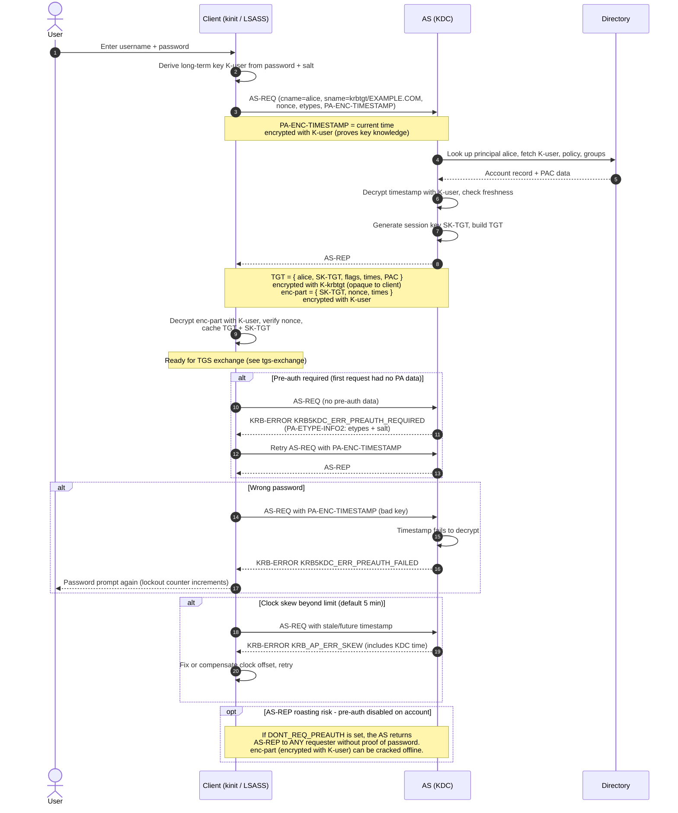

# AS Exchange — Sequence Diagram

Happy path first (pre-authenticated AS-REQ), then the pre-auth negotiation,
wrong password, clock skew, and AS-REP roasting variants.

```mermaid
sequenceDiagram
    autonumber
    actor User
    participant Client as Client (kinit / LSASS)
    participant AS as AS (KDC)
    participant Dir as Directory

    User->>Client: Enter username + password
    Client->>Client: Derive long-term key K-user from password + salt

    Client->>AS: AS-REQ (cname=alice, sname=krbtgt/EXAMPLE.COM,<br/>nonce, etypes, PA-ENC-TIMESTAMP)
    Note over Client,AS: PA-ENC-TIMESTAMP = current time<br/>encrypted with K-user (proves key knowledge)

    AS->>Dir: Look up principal alice, fetch K-user, policy, groups
    Dir-->>AS: Account record + PAC data
    AS->>AS: Decrypt timestamp with K-user, check freshness
    AS->>AS: Generate session key SK-TGT, build TGT

    AS-->>Client: AS-REP
    Note over AS,Client: TGT = { alice, SK-TGT, flags, times, PAC }<br/>encrypted with K-krbtgt (opaque to client)<br/>enc-part = { SK-TGT, nonce, times }<br/>encrypted with K-user
    Client->>Client: Decrypt enc-part with K-user, verify nonce,<br/>cache TGT + SK-TGT
    Note over Client: Ready for TGS exchange (see tgs-exchange)

    alt Pre-auth required (first request had no PA data)
        Client->>AS: AS-REQ (no pre-auth data)
        AS-->>Client: KRB-ERROR KRB5KDC_ERR_PREAUTH_REQUIRED<br/>(PA-ETYPE-INFO2: etypes + salt)
        Client->>AS: Retry AS-REQ with PA-ENC-TIMESTAMP
        AS-->>Client: AS-REP
    end

    alt Wrong password
        Client->>AS: AS-REQ with PA-ENC-TIMESTAMP (bad key)
        AS->>AS: Timestamp fails to decrypt
        AS-->>Client: KRB-ERROR KRB5KDC_ERR_PREAUTH_FAILED
        Client-->>User: Password prompt again (lockout counter increments)
    end

    alt Clock skew beyond limit (default 5 min)
        Client->>AS: AS-REQ with stale/future timestamp
        AS-->>Client: KRB-ERROR KRB_AP_ERR_SKEW (includes KDC time)
        Client->>Client: Fix or compensate clock offset, retry
    end

    opt AS-REP roasting risk - pre-auth disabled on account
        Note over Client,AS: If DONT_REQ_PREAUTH is set, the AS returns<br/>AS-REP to ANY requester without proof of password.<br/>enc-part (encrypted with K-user) can be cracked offline.
    end
```
