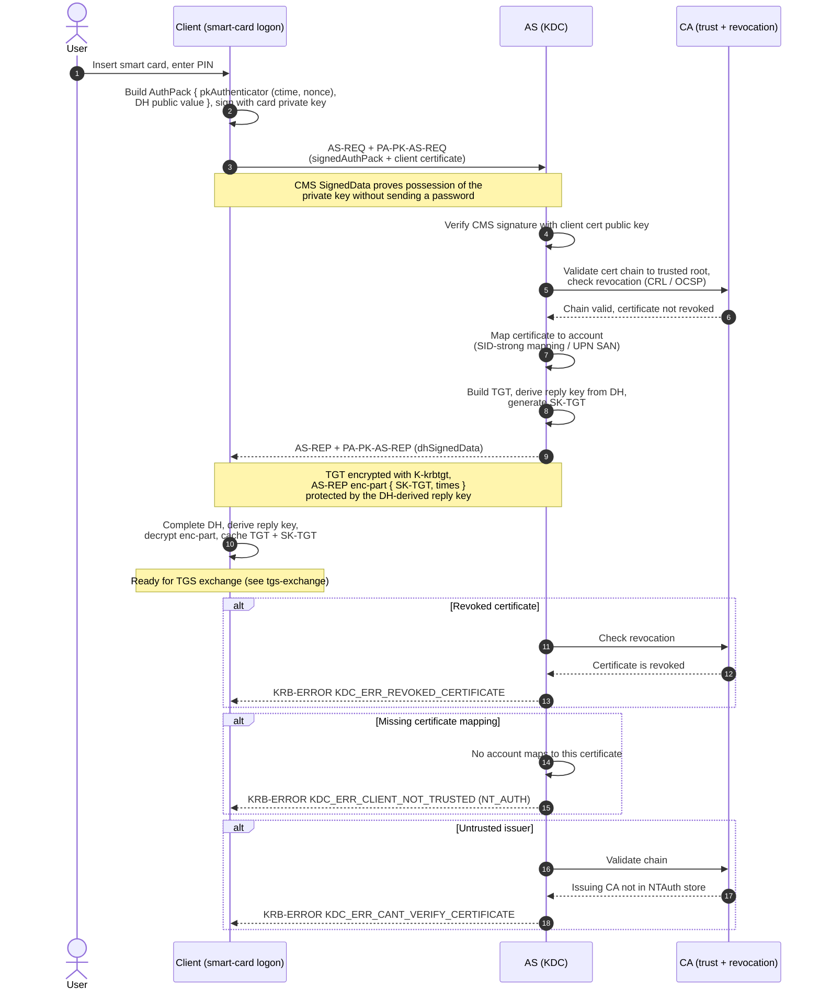

# PKINIT — Sequence Diagram

Happy path first (DH-mode smart-card logon), then revoked-cert, missing-mapping,
and untrusted-issuer variants.

```mermaid
sequenceDiagram
    autonumber
    actor User
    participant Client as Client (smart-card logon)
    participant AS as AS (KDC)
    participant CA as CA (trust + revocation)

    User->>Client: Insert smart card, enter PIN
    Client->>Client: Build AuthPack { pkAuthenticator (ctime, nonce),<br/>DH public value }, sign with card private key
    Client->>AS: AS-REQ + PA-PK-AS-REQ<br/>(signedAuthPack + client certificate)
    Note over Client,AS: CMS SignedData proves possession of the<br/>private key without sending a password

    AS->>AS: Verify CMS signature with client cert public key
    AS->>CA: Validate cert chain to trusted root,<br/>check revocation (CRL / OCSP)
    CA-->>AS: Chain valid, certificate not revoked
    AS->>AS: Map certificate to account<br/>(SID-strong mapping / UPN SAN)
    AS->>AS: Build TGT, derive reply key from DH,<br/>generate SK-TGT

    AS-->>Client: AS-REP + PA-PK-AS-REP (dhSignedData)
    Note over AS,Client: TGT encrypted with K-krbtgt,<br/>AS-REP enc-part { SK-TGT, times }<br/>protected by the DH-derived reply key
    Client->>Client: Complete DH, derive reply key,<br/>decrypt enc-part, cache TGT + SK-TGT
    Note over Client: Ready for TGS exchange (see tgs-exchange)

    alt Revoked certificate
        AS->>CA: Check revocation
        CA-->>AS: Certificate is revoked
        AS-->>Client: KRB-ERROR KDC_ERR_REVOKED_CERTIFICATE
    end

    alt Missing certificate mapping
        AS->>AS: No account maps to this certificate
        AS-->>Client: KRB-ERROR KDC_ERR_CLIENT_NOT_TRUSTED (NT_AUTH)
    end

    alt Untrusted issuer
        AS->>CA: Validate chain
        CA-->>AS: Issuing CA not in NTAuth store
        AS-->>Client: KRB-ERROR KDC_ERR_CANT_VERIFY_CERTIFICATE
    end
```
