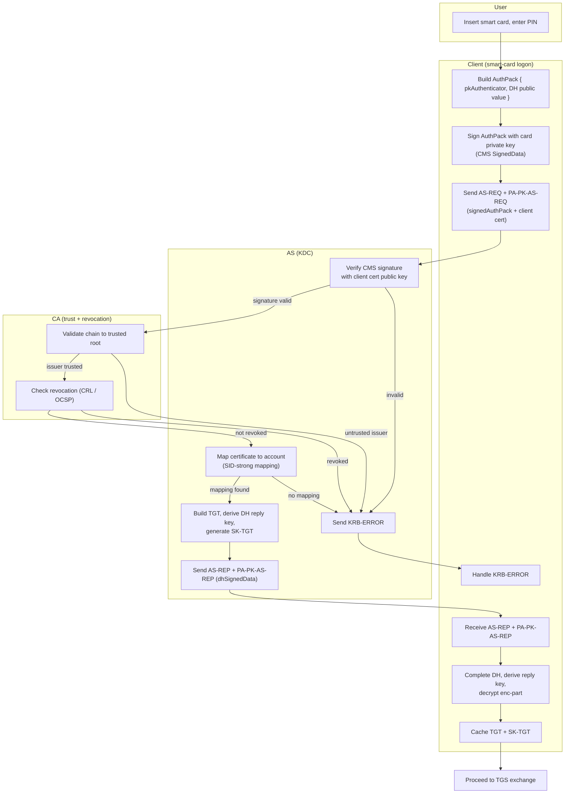

# PKINIT — Swimlane Diagram

One lane per actor; arrows crossing lanes are protocol or validation handoffs.

```mermaid
flowchart TD
    subgraph User
        U1["Insert smart card, enter PIN"]
    end

    subgraph Client["Client (smart-card logon)"]
        C1["Build AuthPack { pkAuthenticator, DH public value }"]
        C2["Sign AuthPack with card private key<br/>(CMS SignedData)"]
        C3["Send AS-REQ + PA-PK-AS-REQ<br/>(signedAuthPack + client cert)"]
        C4["Receive AS-REP + PA-PK-AS-REP"]
        C5["Complete DH, derive reply key,<br/>decrypt enc-part"]
        C6["Cache TGT + SK-TGT"]
        C7["Handle KRB-ERROR"]
    end

    subgraph AS["AS (KDC)"]
        A1["Verify CMS signature<br/>with client cert public key"]
        A2["Map certificate to account<br/>(SID-strong mapping)"]
        A3["Build TGT, derive DH reply key,<br/>generate SK-TGT"]
        A4["Send AS-REP + PA-PK-AS-REP (dhSignedData)"]
        A5["Send KRB-ERROR"]
    end

    subgraph CA["CA (trust + revocation)"]
        CA1["Validate chain to trusted root"]
        CA2["Check revocation (CRL / OCSP)"]
    end

    U1 --> C1
    C1 --> C2
    C2 --> C3
    C3 --> A1
    A1 -->|"signature valid"| CA1
    A1 -->|"invalid"| A5
    CA1 -->|"issuer trusted"| CA2
    CA1 -->|"untrusted issuer"| A5
    CA2 -->|"not revoked"| A2
    CA2 -->|"revoked"| A5
    A2 -->|"mapping found"| A3
    A2 -->|"no mapping"| A5
    A3 --> A4
    A4 --> C4
    C4 --> C5
    C5 --> C6
    A5 --> C7
    C6 --> NEXT["Proceed to TGS exchange"]
```
