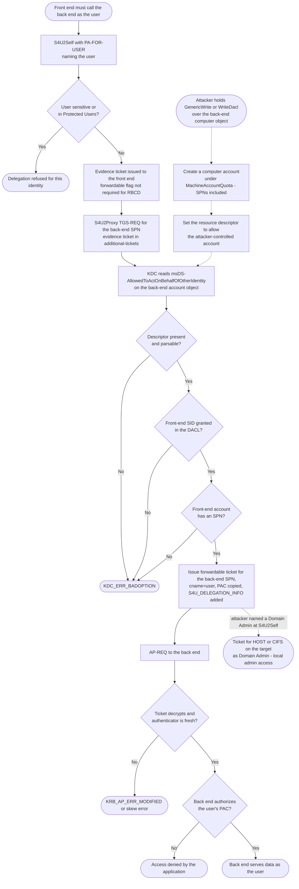

# Resource-Based Constrained Delegation — Decision Flowchart

The protocol decisions, then the abuse path that the same decisions permit when
the resource's attribute is writable by the wrong principal.

Notes

- The dashed subgraph is the RBCD attack path. It reuses the *same* legitimate
  decision nodes — nothing is bypassed. The only precondition is write access to
  one attribute on the target object.
- `Sens` is the single node that blocks step 5 of that path: a Domain Admin marked
  *sensitive and cannot be delegated*, or placed in Protected Users, cannot be
  named at S4U2Self.
- `MachineAccountQuota = 0` removes the `Mkacct` node for ordinary users, forcing
  an attacker to compromise an existing account that already has an SPN.
- `Present` and `Granted` fail identically from the client's point of view —
  `KDC_ERR_BADOPTION` with no detail — which makes directory-side auditing of the
  attribute the only reliable troubleshooting and detection signal.
