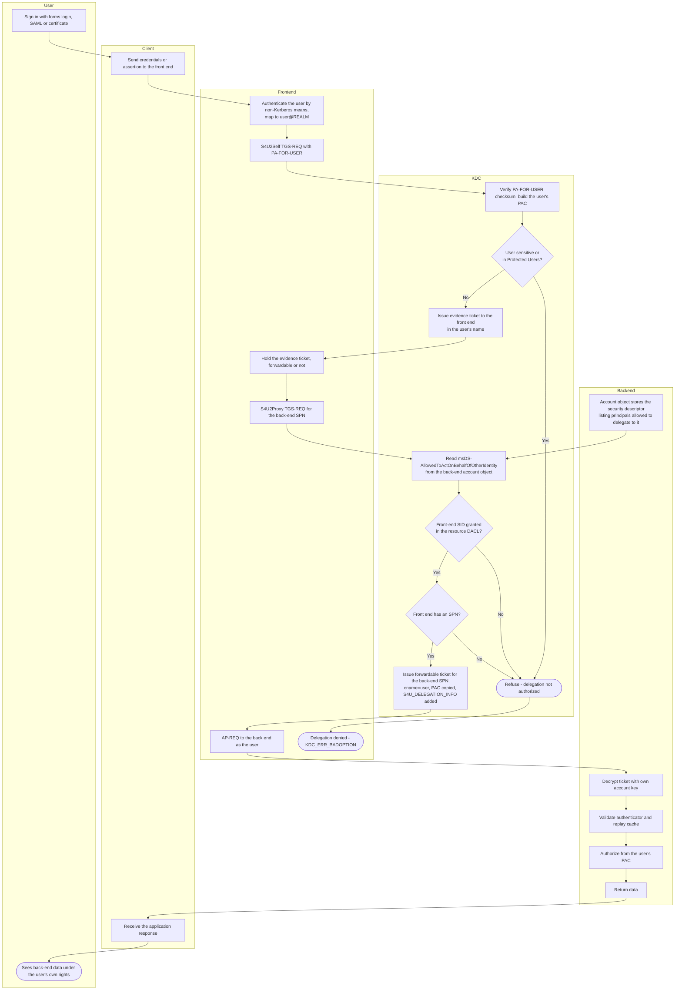

# Resource-Based Constrained Delegation — Swimlane Diagram

The `Backend` lane now owns the authorization data. Note that the `Directory`
lookup happens inside the KDC lane against the back-end account object, before any
ticket is issued.

Notes

- `D1 --> K4` is the whole point of RBCD: the authorization data lives in the
  resource's lane, so the resource owner controls who may impersonate users to it.
- There is no forwardable-flag gate between `F3` and `K4`. Unlike
  [constrained delegation](../constrained-delegation/README.md), RBCD accepts a
  non-forwardable evidence ticket and still returns a forwardable one.
- Anyone who can write `D1` effectively controls the `Backend` lane; see the
  abuse path in [flowchart.md](flowchart.md) and the security notes in
  [README.md](README.md).
