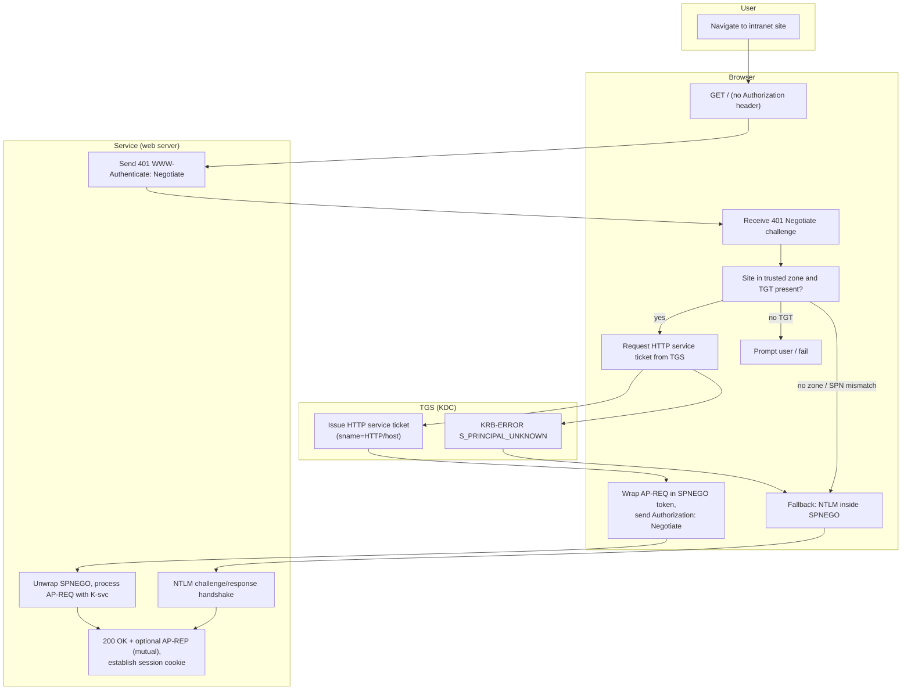

# SPNEGO over HTTP — Swimlane Diagram

One lane per actor; arrows crossing lanes are HTTP or Kerberos handoffs.

```mermaid
flowchart TD
    subgraph User
        U1["Navigate to intranet site"]
    end

    subgraph Browser
        B1["GET / (no Authorization header)"]
        B2["Receive 401 Negotiate challenge"]
        B3["Site in trusted zone and TGT present?"]
        B4["Request HTTP service ticket from TGS"]
        B5["Wrap AP-REQ in SPNEGO token,<br/>send Authorization: Negotiate"]
        B6["Fallback: NTLM inside SPNEGO"]
        B7["Prompt user / fail"]
    end

    subgraph TGS["TGS (KDC)"]
        T1["Issue HTTP service ticket<br/>(sname=HTTP/host)"]
        T2["KRB-ERROR S_PRINCIPAL_UNKNOWN"]
    end

    subgraph Service["Service (web server)"]
        S1["Send 401 WWW-Authenticate: Negotiate"]
        S2["Unwrap SPNEGO, process AP-REQ with K-svc"]
        S3["200 OK + optional AP-REP (mutual),<br/>establish session cookie"]
        S4["NTLM challenge/response handshake"]
    end

    U1 --> B1
    B1 --> S1
    S1 --> B2
    B2 --> B3
    B3 -->|"yes"| B4
    B4 --> T1
    B4 --> T2
    T1 --> B5
    B5 --> S2
    S2 --> S3
    T2 --> B6
    B3 -->|"no zone / SPN mismatch"| B6
    B6 --> S4
    S4 --> S3
    B3 -->|"no TGT"| B7
```
