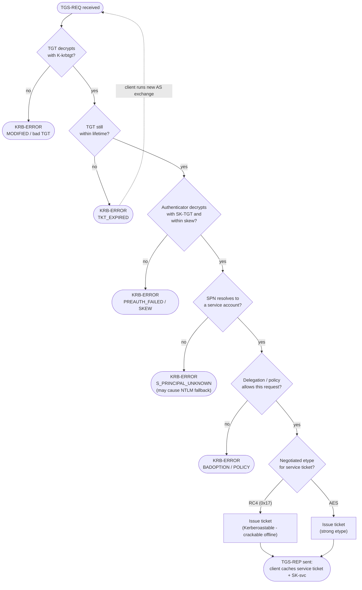

# TGS Exchange — Decision Flowchart

TGS-side decision logic for a TGS-REQ, with explicit error terminals.

```mermaid
flowchart TD
    START(["TGS-REQ received"]) --> V1{"TGT decrypts<br/>with K-krbtgt?"}
    V1 -->|"no"| E1(["KRB-ERROR<br/>MODIFIED / bad TGT"])
    V1 -->|"yes"| V2{"TGT still<br/>within lifetime?"}
    V2 -->|"no"| E2(["KRB-ERROR<br/>TKT_EXPIRED"])
    E2 -.->|"client runs new AS exchange"| START
    V2 -->|"yes"| V3{"Authenticator decrypts<br/>with SK-TGT and<br/>within skew?"}
    V3 -->|"no"| E3(["KRB-ERROR<br/>PREAUTH_FAILED / SKEW"])
    V3 -->|"yes"| V4{"SPN resolves to<br/>a service account?"}
    V4 -->|"no"| E4(["KRB-ERROR<br/>S_PRINCIPAL_UNKNOWN<br/>(may cause NTLM fallback)"])
    V4 -->|"yes"| V5{"Delegation / policy<br/>allows this request?"}
    V5 -->|"no"| E5(["KRB-ERROR<br/>BADOPTION / POLICY"])
    V5 -->|"yes"| V6{"Negotiated etype<br/>for service ticket?"}
    V6 -->|"RC4 (0x17)"| RISK["Issue ticket<br/>(Kerberoastable - crackable offline)"]
    V6 -->|"AES"| OK["Issue ticket<br/>(strong etype)"]
    RISK --> DONE(["TGS-REP sent:<br/>client caches service ticket + SK-svc"])
    OK --> DONE
```
