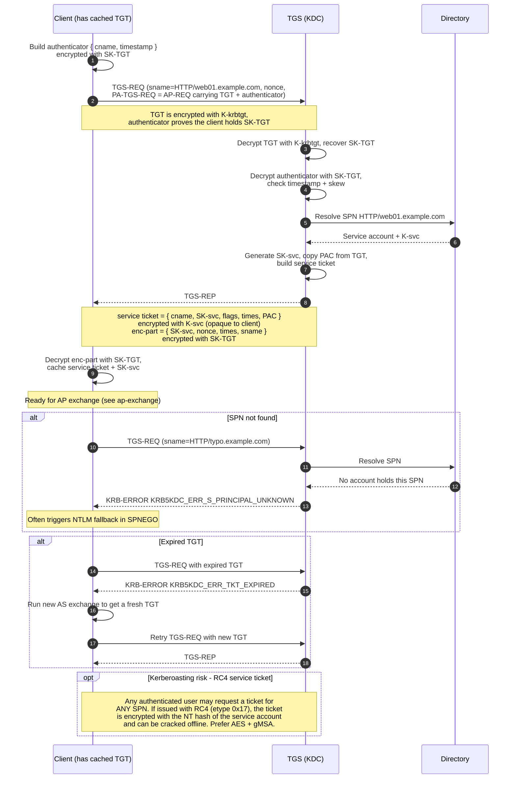

# TGS Exchange — Sequence Diagram

Happy path first (valid TGT, known SPN), then SPN-not-found, expired-TGT, and
the Kerberoasting risk note.

```mermaid
sequenceDiagram
    autonumber
    participant Client as Client (has cached TGT)
    participant TGS as TGS (KDC)
    participant Dir as Directory

    Client->>Client: Build authenticator { cname, timestamp }<br/>encrypted with SK-TGT
    Client->>TGS: TGS-REQ (sname=HTTP/web01.example.com, nonce,<br/>PA-TGS-REQ = AP-REQ carrying TGT + authenticator)
    Note over Client,TGS: TGT is encrypted with K-krbtgt,<br/>authenticator proves the client holds SK-TGT

    TGS->>TGS: Decrypt TGT with K-krbtgt, recover SK-TGT
    TGS->>TGS: Decrypt authenticator with SK-TGT,<br/>check timestamp + skew
    TGS->>Dir: Resolve SPN HTTP/web01.example.com
    Dir-->>TGS: Service account + K-svc
    TGS->>TGS: Generate SK-svc, copy PAC from TGT,<br/>build service ticket
    TGS-->>Client: TGS-REP
    Note over TGS,Client: service ticket = { cname, SK-svc, flags, times, PAC }<br/>encrypted with K-svc (opaque to client)<br/>enc-part = { SK-svc, nonce, times, sname }<br/>encrypted with SK-TGT
    Client->>Client: Decrypt enc-part with SK-TGT,<br/>cache service ticket + SK-svc
    Note over Client: Ready for AP exchange (see ap-exchange)

    alt SPN not found
        Client->>TGS: TGS-REQ (sname=HTTP/typo.example.com)
        TGS->>Dir: Resolve SPN
        Dir-->>TGS: No account holds this SPN
        TGS-->>Client: KRB-ERROR KRB5KDC_ERR_S_PRINCIPAL_UNKNOWN
        Note over Client: Often triggers NTLM fallback in SPNEGO
    end

    alt Expired TGT
        Client->>TGS: TGS-REQ with expired TGT
        TGS-->>Client: KRB-ERROR KRB5KDC_ERR_TKT_EXPIRED
        Client->>Client: Run new AS exchange to get a fresh TGT
        Client->>TGS: Retry TGS-REQ with new TGT
        TGS-->>Client: TGS-REP
    end

    opt Kerberoasting risk - RC4 service ticket
        Note over Client,TGS: Any authenticated user may request a ticket for<br/>ANY SPN. If issued with RC4 (etype 0x17), the ticket<br/>is encrypted with the NT hash of the service account<br/>and can be cracked offline. Prefer AES + gMSA.
    end
```
