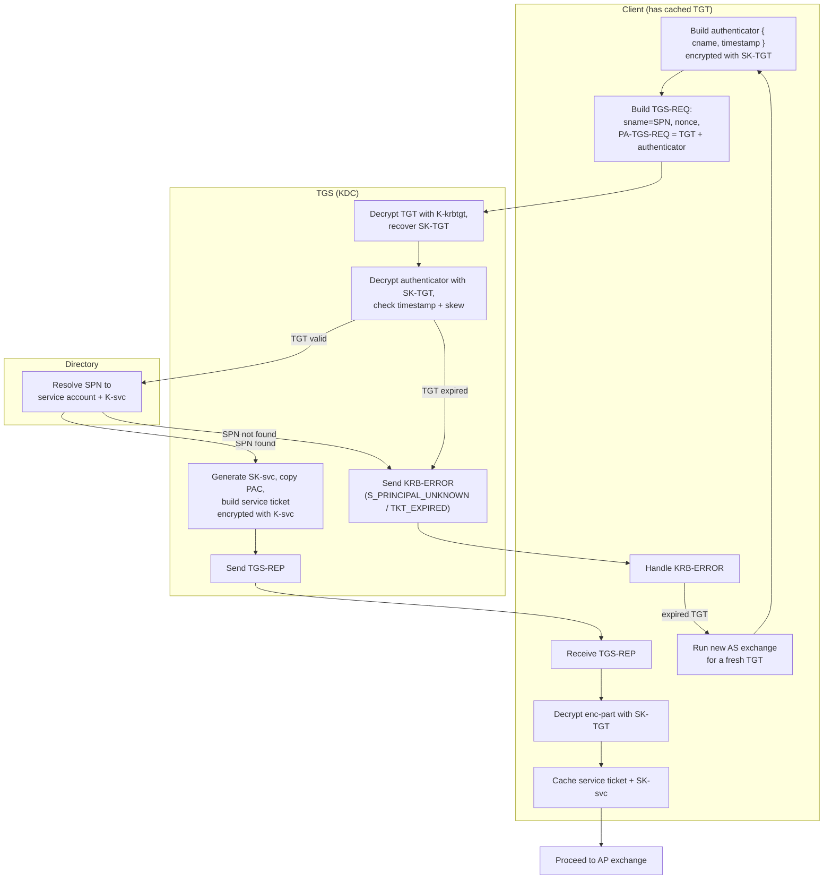

# TGS Exchange — Swimlane Diagram

One lane per actor; arrows crossing lanes are protocol handoffs.

```mermaid
flowchart TD
    subgraph Client["Client (has cached TGT)"]
        C1["Build authenticator { cname, timestamp }<br/>encrypted with SK-TGT"]
        C2["Build TGS-REQ:<br/>sname=SPN, nonce,<br/>PA-TGS-REQ = TGT + authenticator"]
        C3["Receive TGS-REP"]
        C4["Decrypt enc-part with SK-TGT"]
        C5["Cache service ticket + SK-svc"]
        C6["Handle KRB-ERROR"]
        C7["Run new AS exchange<br/>for a fresh TGT"]
    end

    subgraph TGS["TGS (KDC)"]
        T1["Decrypt TGT with K-krbtgt,<br/>recover SK-TGT"]
        T2["Decrypt authenticator with SK-TGT,<br/>check timestamp + skew"]
        T3["Generate SK-svc, copy PAC,<br/>build service ticket<br/>encrypted with K-svc"]
        T4["Send TGS-REP"]
        T5["Send KRB-ERROR<br/>(S_PRINCIPAL_UNKNOWN / TKT_EXPIRED)"]
    end

    subgraph Directory
        D1["Resolve SPN to<br/>service account + K-svc"]
    end

    C1 --> C2
    C2 --> T1
    T1 --> T2
    T2 -->|"TGT valid"| D1
    T2 -->|"TGT expired"| T5
    D1 -->|"SPN found"| T3
    D1 -->|"SPN not found"| T5
    T3 --> T4
    T4 --> C3
    C3 --> C4
    C4 --> C5
    T5 --> C6
    C6 -->|"expired TGT"| C7
    C7 --> C1
    C5 --> NEXT["Proceed to AP exchange"]
```
