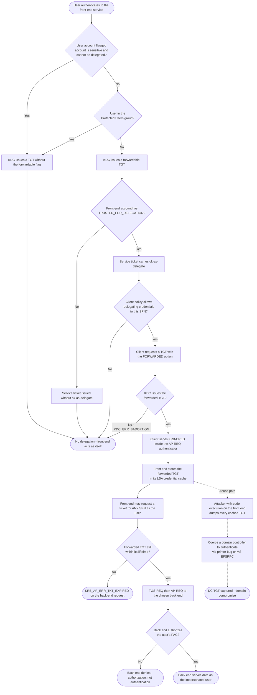

# Unconstrained Delegation — Decision Flowchart

Delegation only happens when every gate below opens. The diagram doubles as the
hardening checklist: closing any one gate stops TGT forwarding.

Notes

- The dashed branch is not part of the protocol flow; it shows where the cached
  credential in `Cache` becomes an attack primitive. It is drawn here because the
  cache is a *design* property of this model, not a misconfiguration.
- `Sens` and `Prot` are the only gates that protect a **specific identity**; the
  others protect a specific service. Tier-0 accounts should rely on the identity
  gates, since any newly flagged service would otherwise be able to impersonate them.
- The failure at `Issued` is what an operator actually sees when the sensitive
  flag is set: the client asks for a forwarded TGT and receives
  `KDC_ERR_BADOPTION`.
- Both scoped alternatives —
  [constrained delegation](../constrained-delegation/README.md) and
  [RBCD](../resource-based-constrained-delegation/README.md) — remove the `Any`
  node entirely and replace it with an allowlist check.
