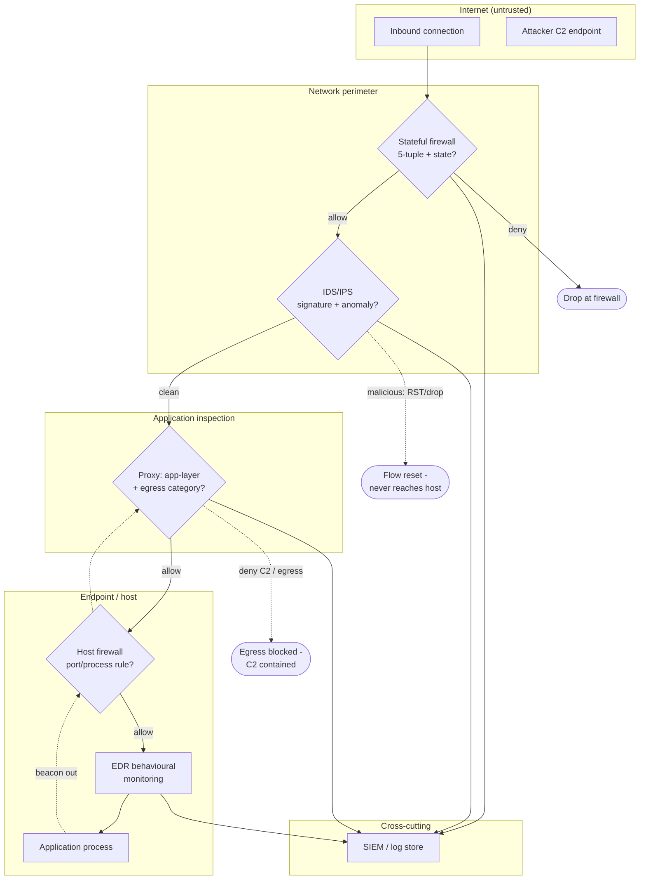

# Defense in Depth — Swimlane

Zones are the successive defensive layers from the Internet down to the host process.
Solid arrows are the allowed inbound path; dashed arrows show the IPS reset and the
blocked outbound C2. Every layer feeds the SIEM.

