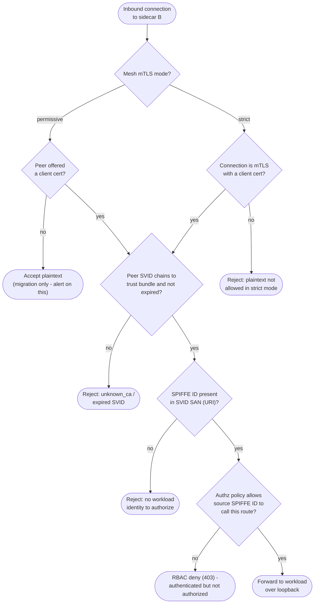

# mTLS in a Service Mesh — Decision Flowchart

How a receiving sidecar decides whether to accept an inbound connection, from mode
selection through identity verification to authorization.

```mermaid
flowchart TD
    Start(["Inbound connection<br/>to sidecar B"]) --> Mode{"Mesh mTLS mode?"}

    Mode -->|"permissive"| Plain{"Peer offered<br/>a client cert?"}
    Plain -->|no| Accept1(["Accept plaintext<br/>(migration only - alert on this)"])
    Plain -->|yes| Verify

    Mode -->|"strict"| MTLS{"Connection is mTLS<br/>with a client cert?"}
    MTLS -->|no| Drop1(["Reject: plaintext not<br/>allowed in strict mode"])
    MTLS -->|yes| Verify{"Peer SVID chains to<br/>trust bundle and not expired?"}

    Verify -->|no| Drop2(["Reject: unknown_ca /<br/>expired SVID"])
    Verify -->|yes| SanOK{"SPIFFE ID present<br/>in SVID SAN (URI)?"}
    SanOK -->|no| Drop3(["Reject: no workload<br/>identity to authorize"])
    SanOK -->|yes| Policy{"Authz policy allows<br/>source SPIFFE ID to<br/>call this route?"}

    Policy -->|no| Deny(["RBAC deny (403) -<br/>authenticated but not authorized"])
    Policy -->|yes| Fwd(["Forward to workload<br/>over loopback"])
```
