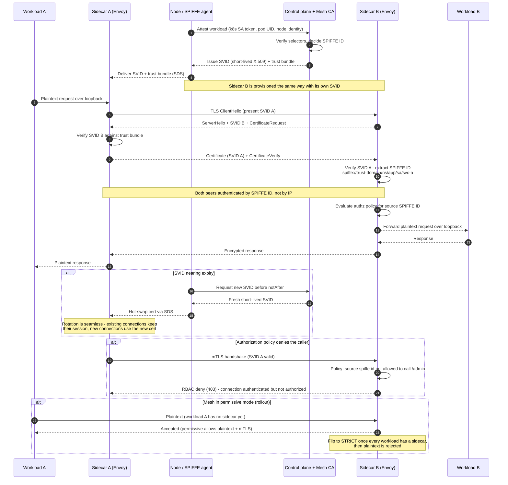

# mTLS in a Service Mesh — Sequence Diagram

Happy path: workload attestation, SVID issuance, then a sidecar-to-sidecar mutual-TLS
call with policy enforcement. Alternates: cert rotation, policy deny, and permissive-mode
plaintext.

