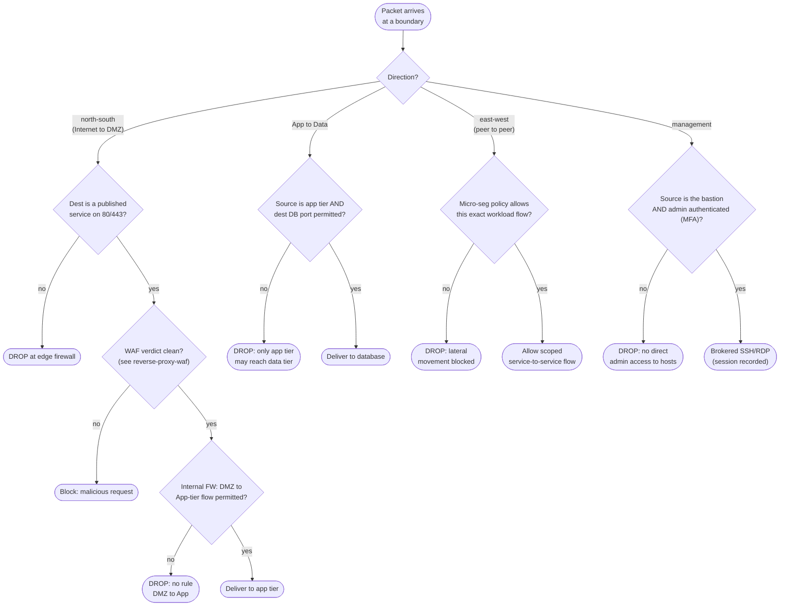

# Network Segmentation and the DMZ — Decision Flowchart

How a packet is evaluated as it tries to cross each boundary. Every boundary is
default-deny; only explicitly allowed source/destination/port flows pass.

