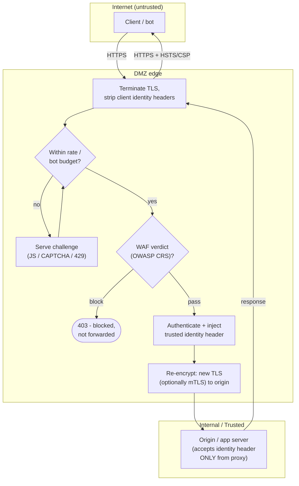

# Reverse Proxy and WAF — Swimlane

Zones: the untrusted client, the DMZ edge (proxy + WAF + rate limiter), and the internal
origin. TLS is terminated in the DMZ and re-originated on the internal hop.

