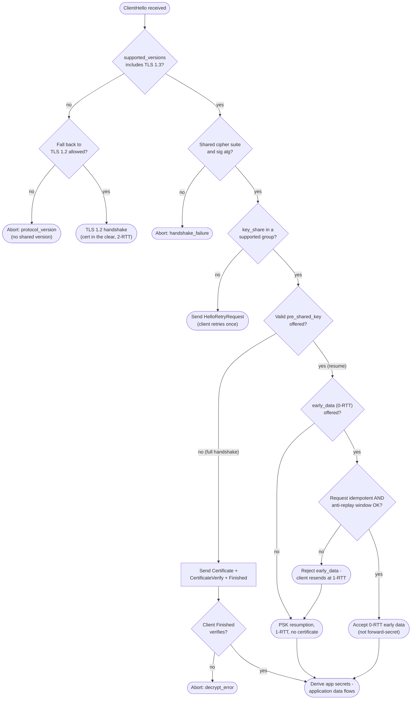

# TLS 1.3 Handshake — Decision Flowchart

Server-side decision logic from receiving `ClientHello` to application data, with
explicit terminals for retry, resumption, 0-RTT accept/reject, and abort.

