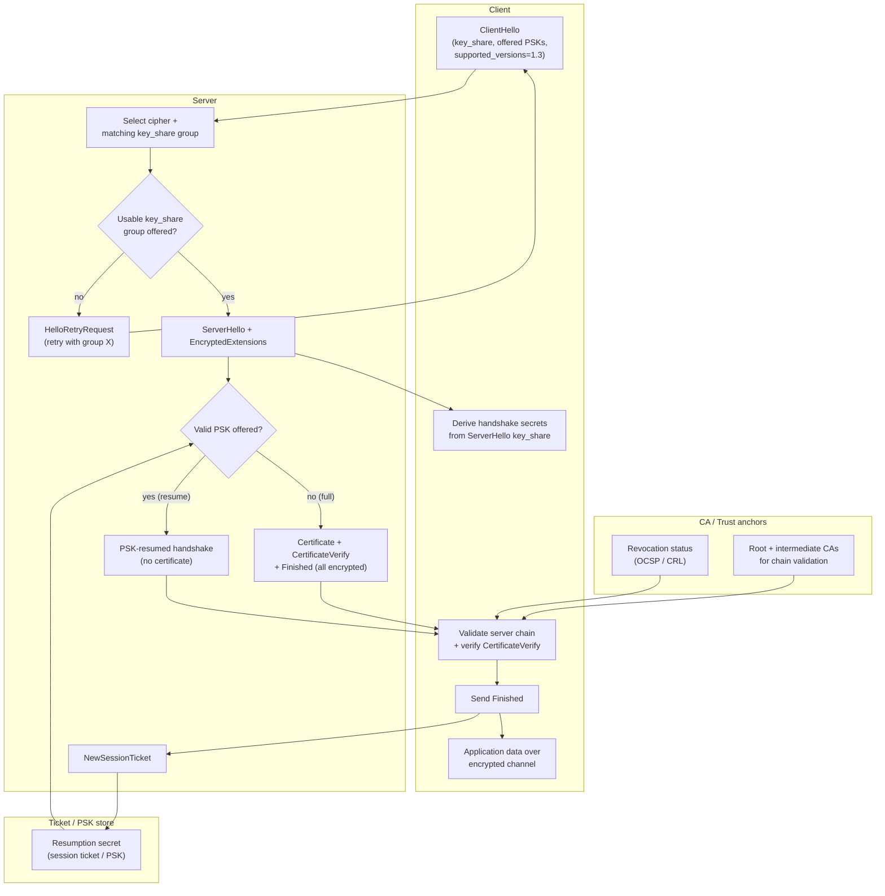

# TLS 1.3 Handshake — Swimlane

Lanes are the participants in the handshake. Flows show the 1-RTT full handshake and
where resumption and 0-RTT branch off.

```mermaid
flowchart TD
    subgraph Client
        C1["ClientHello<br/>(key_share, offered PSKs,<br/>supported_versions=1.3)"]
        C2["Derive handshake secrets<br/>from ServerHello key_share"]
        C3["Validate server chain<br/>+ verify CertificateVerify"]
        C4["Send Finished"]
        C5["Application data over<br/>encrypted channel"]
    end

    subgraph Server
        S1["Select cipher +<br/>matching key_share group"]
        S2{"Usable key_share<br/>group offered?"}
        S3["HelloRetryRequest<br/>(retry with group X)"]
        S4["ServerHello + EncryptedExtensions"]
        S5{"Valid PSK offered?"}
        S6["Certificate + CertificateVerify<br/>+ Finished (all encrypted)"]
        S7["PSK-resumed handshake<br/>(no certificate)"]
        S8["NewSessionTicket"]
    end

    subgraph Trust["CA / Trust anchors"]
        T1["Root + intermediate CAs<br/>for chain validation"]
        T2["Revocation status<br/>(OCSP / CRL)"]
    end

    subgraph Store["Ticket / PSK store"]
        K1["Resumption secret<br/>(session ticket / PSK)"]
    end

    C1 --> S1 --> S2
    S2 -->|no| S3 --> C1
    S2 -->|yes| S4 --> C2
    S4 --> S5
    S5 -->|"no (full)"| S6
    S5 -->|"yes (resume)"| S7
    K1 --> S5
    S6 --> C3
    S7 --> C3
    T1 --> C3
    T2 --> C3
    C3 --> C4 --> S8
    S8 --> K1
    C4 --> C5
```
