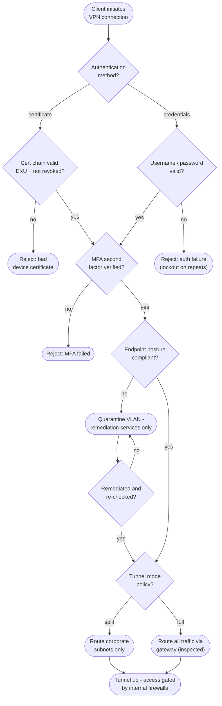

# Remote Access VPN — Decision Flowchart

Gateway decision logic for a connection attempt, from authentication through posture to
tunnel mode, with explicit reject and quarantine terminals.

```mermaid
flowchart TD
    Start(["Client initiates<br/>VPN connection"]) --> AuthType{"Authentication<br/>method?"}

    AuthType -->|"certificate"| Cert{"Cert chain valid,<br/>EKU + not revoked?"}
    Cert -->|no| Reject1(["Reject: bad<br/>device certificate"])
    Cert -->|yes| MFA

    AuthType -->|"credentials"| Cred{"Username / password<br/>valid?"}
    Cred -->|no| Reject2(["Reject: auth failure<br/>(lockout on repeats)"])
    Cred -->|yes| MFA{"MFA second<br/>factor verified?"}

    MFA -->|no| Reject3(["Reject: MFA failed"])
    MFA -->|yes| Posture{"Endpoint posture<br/>compliant?"}

    Posture -->|"no"| Quar(["Quarantine VLAN -<br/>remediation services only"])
    Quar --> Recheck{"Remediated and<br/>re-checked?"}
    Recheck -->|no| Quar
    Recheck -->|yes| Mode

    Posture -->|yes| Mode{"Tunnel mode<br/>policy?"}
    Mode -->|"split"| Split(["Route corporate<br/>subnets only"])
    Mode -->|"full"| Full(["Route all traffic via<br/>gateway (inspected)"])

    Split --> Inside(["Tunnel up - access gated<br/>by internal firewalls"])
    Full --> Inside
```
