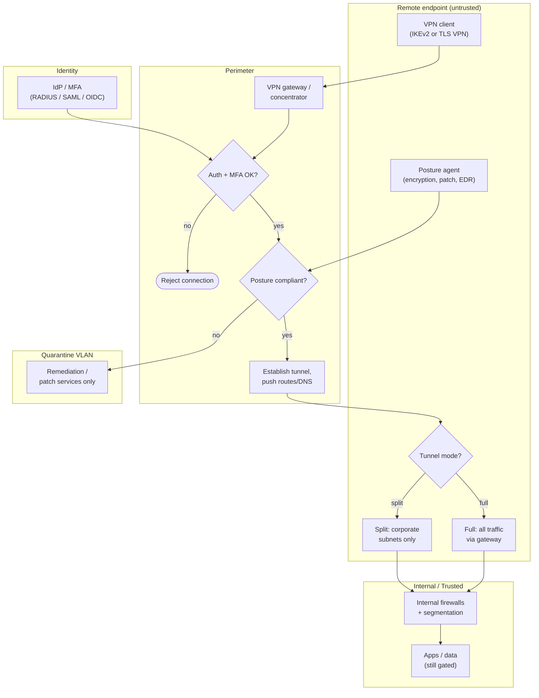

# Remote Access VPN — Swimlane

Zones from the untrusted endpoint through the gateway into the trusted network. The
gateway is the choke point where auth, MFA, and posture converge before any internal
route is pushed.

