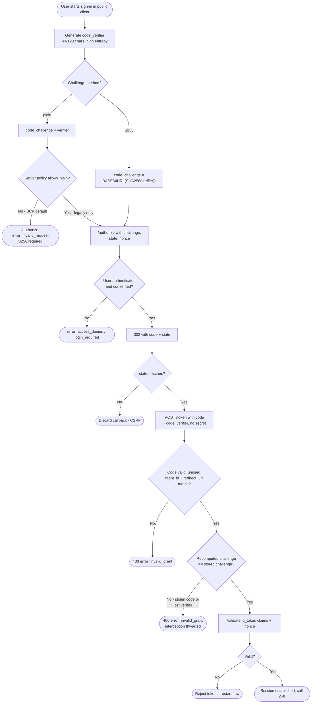

# Authorization Code + PKCE — Decision Flowchart

Challenge-method policy, verifier check, and the resulting error terminals.

```mermaid
flowchart TD
    S([User starts sign-in in public client]) --> G1["Generate code_verifier<br/>43-128 chars, high entropy"]
    G1 --> Q1{Challenge method?}
    Q1 -->|S256| C1["code_challenge =<br/>BASE64URL(SHA256(verifier))"]
    Q1 -->|plain| C2["code_challenge = verifier"]
    C2 --> Q2{Server policy allows plain?}
    Q2 -->|No - BCP default| E1(["/authorize error=invalid_request<br/>S256 required"])
    Q2 -->|Yes - legacy only| AZ
    C1 --> AZ["/authorize with challenge,<br/>state, nonce"]

    AZ --> Q3{User authenticated<br/>and consented?}
    Q3 -->|No| E2([error=access_denied / login_required])
    Q3 -->|Yes| CB["302 with code + state"]
    CB --> Q4{state matches?}
    Q4 -->|No| E3([Discard callback - CSRF])
    Q4 -->|Yes| TK["POST /token with code<br/>+ code_verifier, no secret"]

    TK --> Q5{"Code valid, unused,<br/>client_id + redirect_uri match?"}
    Q5 -->|No| E4(["400 error=invalid_grant"])
    Q5 -->|Yes| Q6{"Recomputed challenge<br/>== stored challenge?"}
    Q6 -->|No - stolen code or<br/>lost verifier| E5(["400 error=invalid_grant<br/>interception thwarted"])
    Q6 -->|Yes| V1["Validate id_token claims + nonce"]
    V1 --> Q7{Valid?}
    Q7 -->|No| E6([Reject tokens, restart flow])
    Q7 -->|Yes| OK([Session established, call API])
```
