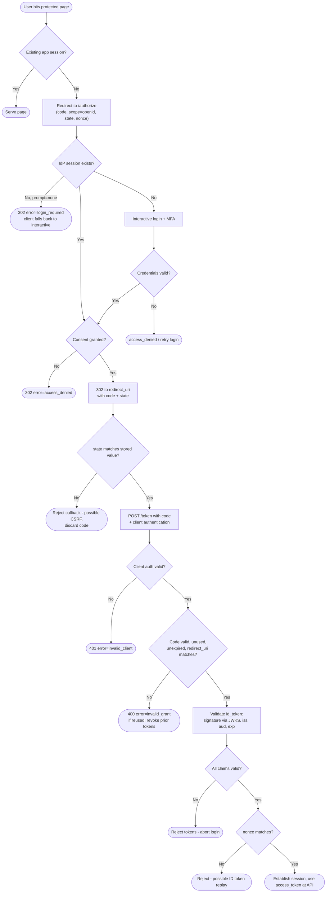

# Authorization Code Flow — Decision Flowchart

Validation and error branches from the client and IdP perspective.

```mermaid
flowchart TD
    S([User hits protected page]) --> Q1{Existing app session?}
    Q1 -->|Yes| OK1([Serve page])
    Q1 -->|No| R1["Redirect to /authorize<br/>(code, scope=openid, state, nonce)"]

    R1 --> Q2{IdP session exists?}
    Q2 -->|No, prompt=none| E1(["302 error=login_required<br/>client falls back to interactive"])
    Q2 -->|No| L1[Interactive login + MFA]
    Q2 -->|Yes| Q3
    L1 --> Q4{Credentials valid?}
    Q4 -->|No| E2([access_denied / retry login])
    Q4 -->|Yes| Q3{Consent granted?}
    Q3 -->|No| E3(["302 error=access_denied"])
    Q3 -->|Yes| CB["302 to redirect_uri<br/>with code + state"]

    CB --> Q5{state matches stored value?}
    Q5 -->|No| E4(["Reject callback - possible CSRF,<br/>discard code"])
    Q5 -->|Yes| T1["POST /token with code<br/>+ client authentication"]

    T1 --> Q6{Client auth valid?}
    Q6 -->|No| E5([401 error=invalid_client])
    Q6 -->|Yes| Q7{"Code valid, unused,<br/>unexpired, redirect_uri matches?"}
    Q7 -->|No| E6(["400 error=invalid_grant<br/>if reused: revoke prior tokens"])
    Q7 -->|Yes| V1["Validate id_token:<br/>signature via JWKS, iss, aud, exp"]

    V1 --> Q8{All claims valid?}
    Q8 -->|No| E7([Reject tokens - abort login])
    Q8 -->|Yes| Q9{nonce matches?}
    Q9 -->|No| E8([Reject - possible ID token replay])
    Q9 -->|Yes| OK2([Establish session, use access_token at API])
```
