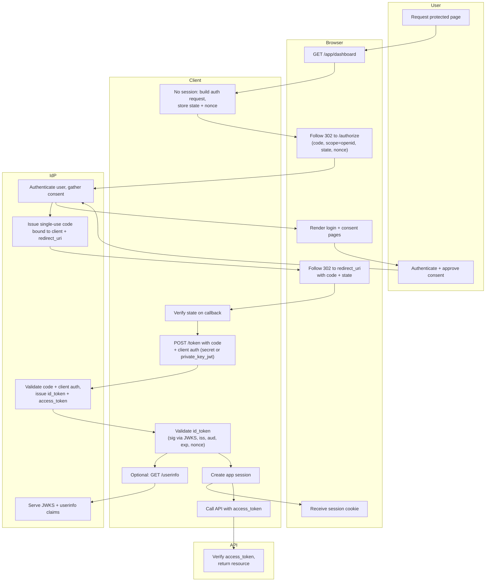

# Authorization Code Flow — Swimlane

One lane per actor. Front-channel steps pass through the Browser lane; the code redemption
and UserInfo call are back-channel (Client to IdP directly).

```mermaid
flowchart TD
    subgraph User
        U1[Request protected page]
        U2[Authenticate + approve consent]
    end

    subgraph Browser
        B1[GET /app/dashboard]
        B2["Follow 302 to /authorize<br/>(code, scope=openid, state, nonce)"]
        B3[Render login + consent pages]
        B4["Follow 302 to redirect_uri<br/>with code + state"]
        B5[Receive session cookie]
    end

    subgraph Client
        C1["No session: build auth request,<br/>store state + nonce"]
        C2[Verify state on callback]
        C3["POST /token with code<br/>+ client auth (secret or private_key_jwt)"]
        C4["Validate id_token<br/>(sig via JWKS, iss, aud, exp, nonce)"]
        C5["Optional: GET /userinfo"]
        C6[Create app session]
        C7["Call API with access_token"]
    end

    subgraph IdP
        I1[Authenticate user, gather consent]
        I2["Issue single-use code<br/>bound to client + redirect_uri"]
        I3["Validate code + client auth,<br/>issue id_token + access_token"]
        I4[Serve JWKS + userinfo claims]
    end

    subgraph API
        A1["Verify access_token,<br/>return resource"]
    end

    U1 --> B1 --> C1 --> B2 --> I1
    B3 --> U2 --> I1
    I1 --> I2 --> B4 --> C2
    I1 --> B3
    C2 --> C3 --> I3 --> C4
    C4 --> C5 --> I4
    C4 --> C6 --> B5
    C6 --> C7 --> A1
```
