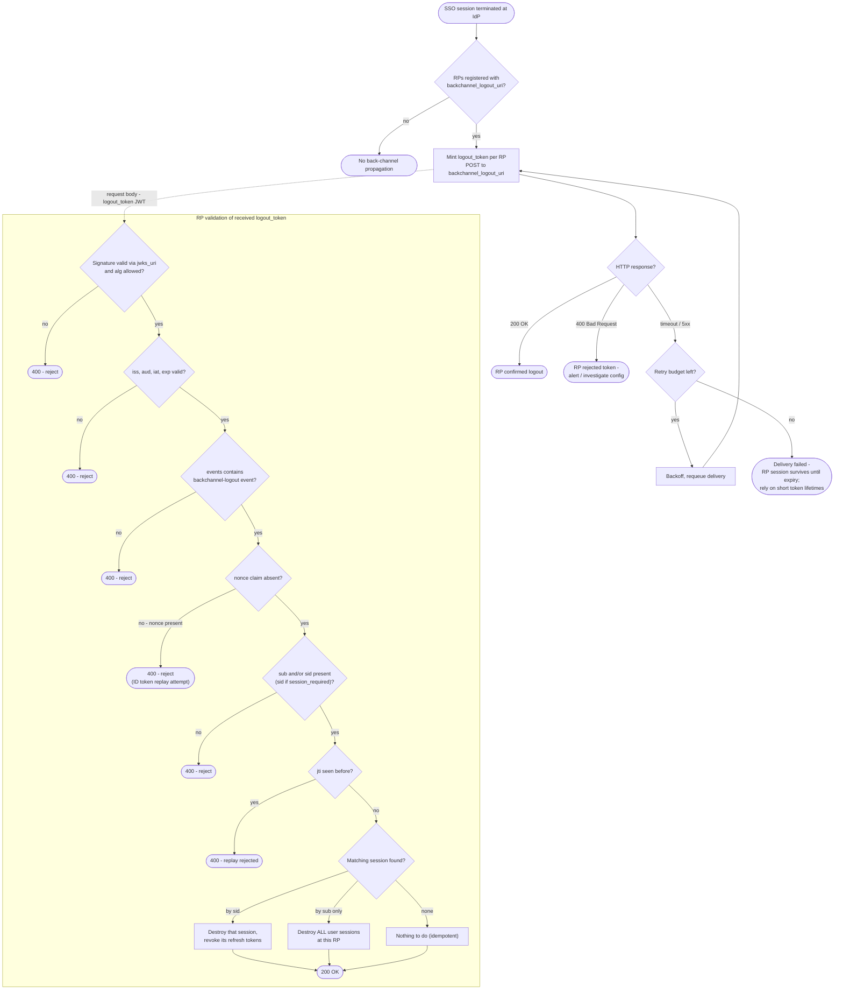

# Back-Channel Logout — Decision Flowchart

Two decision chains: the IdP's delivery/retry loop, and the RP's logout token
validation gauntlet with explicit rejection terminals.

Notes

- Every rejection terminal returns 400 without touching sessions — acting on an
  unvalidated logout token would let attackers force-logout users.
- The IdP-side failure terminal is why short access-token lifetimes remain necessary
  even with back-channel logout deployed.

Related: [README](README.md) | [Sequence](sequence.md) | [Swimlane](swimlane.md)
