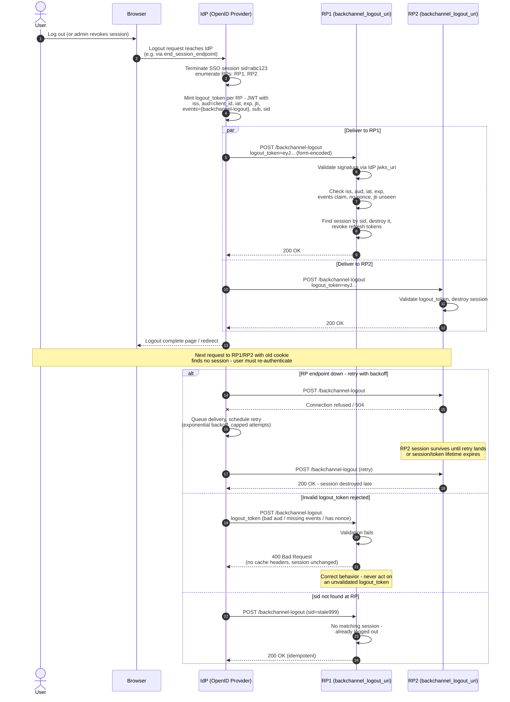

# Back-Channel Logout — Sequence Diagram

Happy path: IdP POSTs a logout token to each RP in the terminated session; RPs
validate and destroy sessions. Alternates: RP endpoint down with retry, invalid
logout token rejected.

Notes

- The logout token is validated like an ID token except: no `nonce` allowed, and the
  `events` claim is mandatory.
- Delivery is at-least-once; RP handlers must be idempotent (`jti` cache, tolerant of
  unknown `sid`).

Related: [README](README.md) | [Swimlane](swimlane.md) | [Flowchart](flowchart.md)
