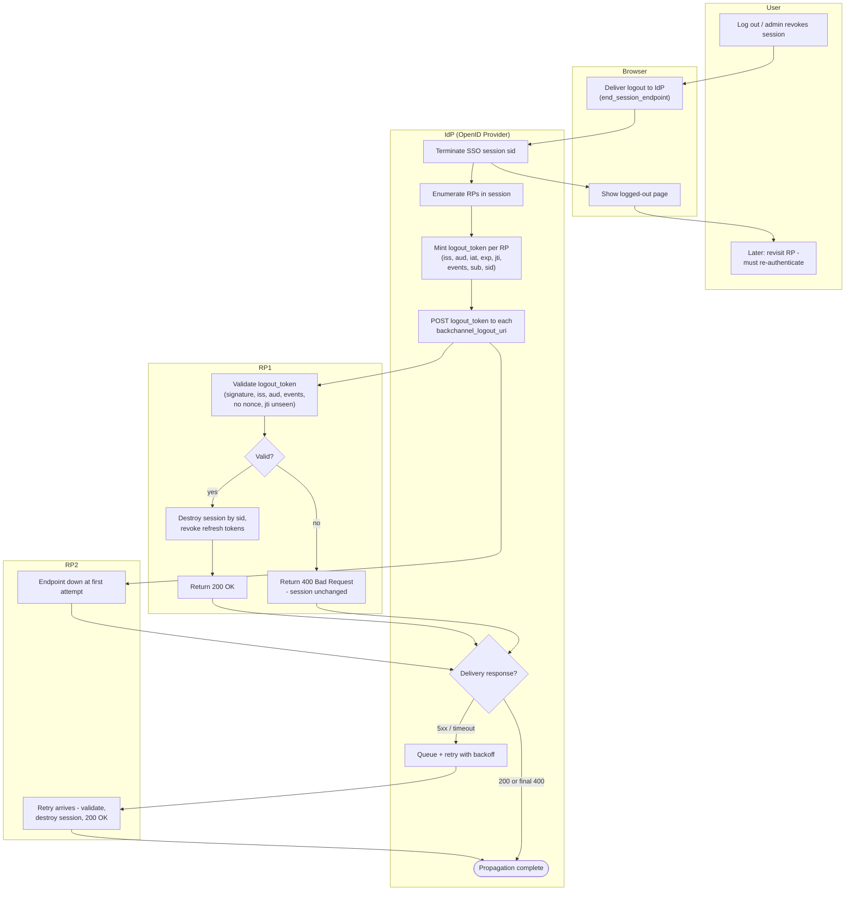

# Back-Channel Logout — Swimlane Diagram

One lane per actor. Note the browser lane goes quiet after triggering logout —
propagation happens entirely server-to-server.

Related: [README](README.md) | [Sequence](sequence.md) | [Flowchart](flowchart.md)
