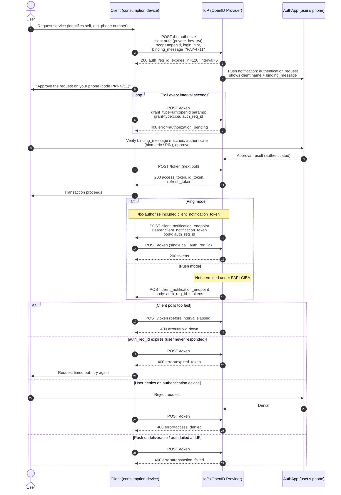

# CIBA — Sequence Diagram

Happy path in **poll mode**, then the ping and push delivery modes and the
expiry/denial outcomes as alternates.

Notes

- Exactly one of `login_hint`, `login_hint_token`, `id_token_hint` goes in the
  backchannel request.
- In ping/push modes the IdP authenticates its callback with the
  `client_notification_token` the client supplied.

Related: [README](README.md) | [Swimlane](swimlane.md) | [Flowchart](flowchart.md)
