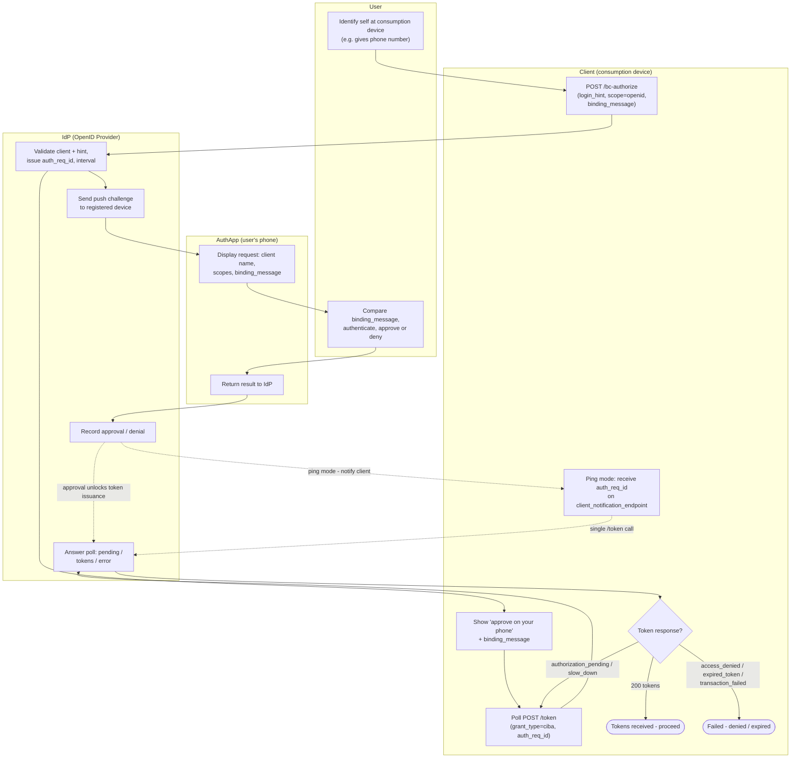

# CIBA — Swimlane Diagram

Poll-mode happy path with the ping-mode shortcut shown as a dashed handoff.
One lane per actor.

Related: [README](README.md) | [Sequence](sequence.md) | [Flowchart](flowchart.md)
