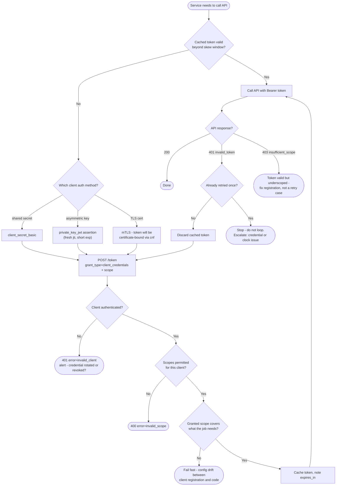

# Client Credentials Grant — Decision Flowchart

Token caching, auth-method selection, and bounded retry logic.

```mermaid
flowchart TD
    S([Service needs to call API]) --> Q1{Cached token valid<br/>beyond skew window?}
    Q1 -->|Yes| CALL["Call API with Bearer token"]
    Q1 -->|No| Q2{Which client auth method?}

    Q2 -->|shared secret| M1["client_secret_basic"]
    Q2 -->|asymmetric key| M2["private_key_jwt assertion<br/>(fresh jti, short exp)"]
    Q2 -->|TLS cert| M3["mTLS - token will be<br/>certificate-bound via cnf"]

    M1 --> TK["POST /token<br/>grant_type=client_credentials + scope"]
    M2 --> TK
    M3 --> TK

    TK --> Q3{Client authenticated?}
    Q3 -->|No| E1(["401 error=invalid_client<br/>alert - credential rotated or revoked?"])
    Q3 -->|Yes| Q4{Scopes permitted<br/>for this client?}
    Q4 -->|No| E2(["400 error=invalid_scope"])
    Q4 -->|Yes| Q5{Granted scope covers<br/>what the job needs?}
    Q5 -->|No| E3(["Fail fast - config drift between<br/>client registration and code"])
    Q5 -->|Yes| C1["Cache token, note expires_in"] --> CALL

    CALL --> Q6{API response?}
    Q6 -->|200| OK([Done])
    Q6 -->|"401 invalid_token"| Q7{Already retried once?}
    Q7 -->|No| R1["Discard cached token"] --> TK
    Q7 -->|Yes| E4(["Stop - do not loop.<br/>Escalate: credential or clock issue"])
    Q6 -->|"403 insufficient_scope"| E5(["Token valid but underscoped -<br/>fix registration, not a retry case"])
```
