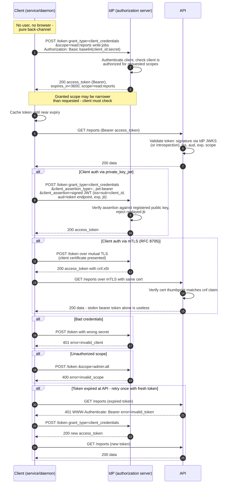

# Client Credentials Grant — Sequence Diagram

Happy path with `client_secret_basic`, then `private_key_jwt` and mTLS alternates,
scope errors, and the 401-then-retry pattern.

```mermaid
sequenceDiagram
    autonumber
    participant Client as Client (service/daemon)
    participant IdP as IdP (authorization server)
    participant API

    Note over Client: No user, no browser -<br/>pure back-channel

    Client->>IdP: POST /token grant_type=client_credentials<br/>&scope=read:reports write:jobs<br/>Authorization: Basic base64(client_id:secret)
    IdP->>IdP: Authenticate client, check client is<br/>authorized for requested scopes
    IdP-->>Client: 200 access_token (Bearer),<br/>expires_in=3600, scope=read:reports
    Note over Client,IdP: Granted scope may be narrower<br/>than requested - client must check
    Client->>Client: Cache token until near expiry

    Client->>API: GET /reports (Bearer access_token)
    API->>API: Validate token: signature via IdP JWKS<br/>(or introspection), iss, aud, exp, scope
    API-->>Client: 200 data

    alt Client auth via private_key_jwt
        Client->>IdP: POST /token grant_type=client_credentials<br/>&client_assertion_type=...jwt-bearer<br/>&client_assertion=signed JWT (iss=sub=client_id,<br/>aud=token endpoint, exp, jti)
        IdP->>IdP: Verify assertion against registered public key,<br/>reject replayed jti
        IdP-->>Client: 200 access_token
    end

    alt Client auth via mTLS (RFC 8705)
        Client->>IdP: POST /token over mutual TLS<br/>(client certificate presented)
        IdP-->>Client: 200 access_token with cnf.x5t#S256<br/>(certificate-bound)
        Client->>API: GET /reports over mTLS with same cert
        API->>API: Verify cert thumbprint matches cnf claim
        API-->>Client: 200 data - stolen bearer token alone is useless
    end

    alt Bad credentials
        Client->>IdP: POST /token with wrong secret
        IdP-->>Client: 401 error=invalid_client
    end

    alt Unauthorized scope
        Client->>IdP: POST /token &scope=admin:all
        IdP-->>Client: 400 error=invalid_scope
    end

    alt Token expired at API - retry once with fresh token
        Client->>API: GET /reports (expired token)
        API-->>Client: 401 WWW-Authenticate: Bearer error=invalid_token
        Client->>IdP: POST /token grant_type=client_credentials
        IdP-->>Client: 200 new access_token
        Client->>API: GET /reports (new token)
        API-->>Client: 200 data
    end
```
