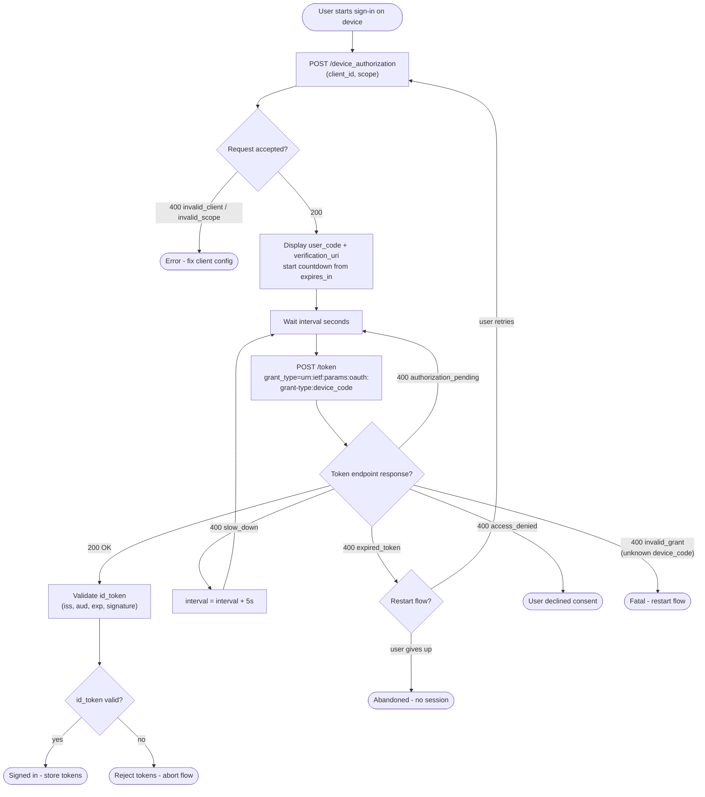

# Device Authorization Grant — Decision Flowchart

Decision logic on the device side, including every RFC 8628 token-endpoint
error code and its handling.

Notes

- `slow_down` is the only error that mutates polling state; everything else either
  loops unchanged (`authorization_pending`) or terminates.
- The device must stop polling once `expires_in` has elapsed locally even if it
  never sees `expired_token`.

Related: [README](README.md) | [Sequence](sequence.md) | [Swimlane](swimlane.md)
