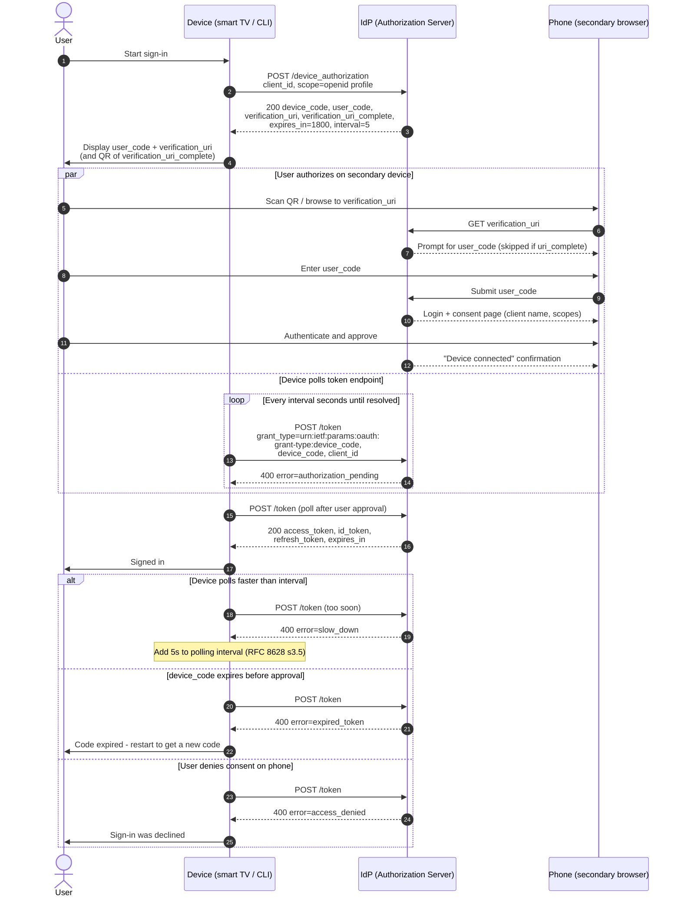

# Device Authorization Grant — Sequence Diagram

RFC 8628 device flow: a smart TV / CLI obtains tokens by having the user approve
the request on a secondary device while the client polls the token endpoint.

Notes

- Polling and user approval genuinely overlap, hence the `par` block.
- `verification_uri_complete` lets a QR scan skip manual code entry; the IdP should
  still show client name and scopes before consent.

Related: [README](README.md) | [Swimlane](swimlane.md) | [Flowchart](flowchart.md)
