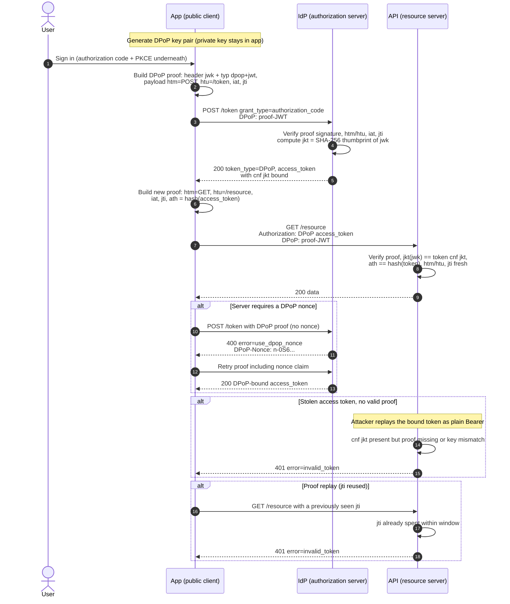

# DPoP — Sequence Diagram

Happy path: DPoP proof at `/token` binds the access token to the key, then a proof
with `ath` at the API. Then the nonce challenge, a stolen-token replay, and a
proof replay.

