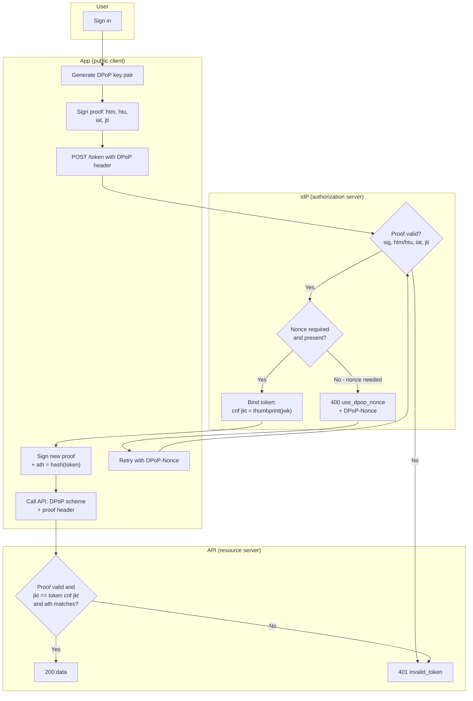

# DPoP — Swimlane

The App signs a fresh proof per request; the IdP binds the token to the key
thumbprint; the API checks proof, thumbprint, and `ath` on every call.

```mermaid
flowchart TD
    subgraph User
        U1["Sign in"]
    end

    subgraph App["App (public client)"]
        A1["Generate DPoP key pair"]
        A2["Sign proof: htm, htu,<br/>iat, jti"]
        A3["POST /token with DPoP header"]
        A4["Sign new proof<br/>+ ath = hash(token)"]
        A5["Call API: DPoP scheme<br/>+ proof header"]
        A6["Retry with DPoP-Nonce"]
    end

    subgraph IdP["IdP (authorization server)"]
        I1{"Proof valid?<br/>sig, htm/htu, iat, jti"}
        I2{"Nonce required<br/>and present?"}
        I3["Bind token:<br/>cnf jkt = thumbprint(jwk)"]
        I4["400 use_dpop_nonce<br/>+ DPoP-Nonce"]
    end

    subgraph API["API (resource server)"]
        P1{"Proof valid and<br/>jkt == token cnf jkt<br/>and ath matches?"}
        P2["200 data"]
        P3["401 invalid_token"]
    end

    U1 --> A1 --> A2 --> A3 --> I1
    I1 -->|No| P3
    I1 -->|Yes| I2
    I2 -->|"No - nonce needed"| I4 --> A6 --> I1
    I2 -->|Yes| I3 --> A4 --> A5 --> P1
    P1 -->|No| P3
    P1 -->|Yes| P2
```
