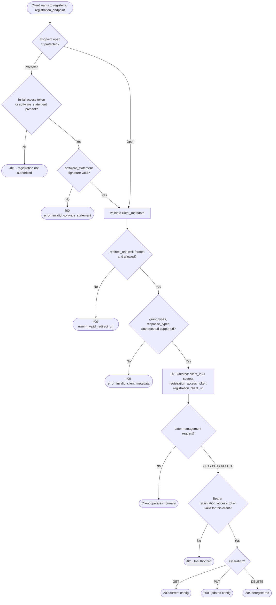

# Dynamic Client Registration — Decision Flowchart

From a registration attempt through authorization, metadata validation, and
lifecycle management, with explicit error terminals.

```mermaid
flowchart TD
    S(["Client wants to register at registration_endpoint"]) --> Q1{Endpoint open<br/>or protected?}
    Q1 -->|Protected| Q2{Initial access token<br/>or software_statement present?}
    Q2 -->|No| E1(["401 - registration not authorized"])
    Q2 -->|Yes| Q3{"software_statement<br/>signature valid?"}
    Q3 -->|No| E2(["400 error=invalid_software_statement"])
    Q3 -->|Yes| VAL
    Q1 -->|Open| VAL["Validate client_metadata"]

    VAL --> Q4{redirect_uris well-formed<br/>and allowed?}
    Q4 -->|No| E3(["400 error=invalid_redirect_uri"])
    Q4 -->|Yes| Q5{grant_types, response_types,<br/>auth method supported?}
    Q5 -->|No| E4(["400 error=invalid_client_metadata"])
    Q5 -->|Yes| REG["201 Created: client_id (+ secret),<br/>registration_access_token,<br/>registration_client_uri"]

    REG --> Q6{Later management request?}
    Q6 -->|"No"| DONE([Client operates normally])
    Q6 -->|"GET / PUT / DELETE"| Q7{Bearer registration_access_token<br/>valid for this client?}
    Q7 -->|No| E5(["401 Unauthorized"])
    Q7 -->|Yes| Q8{Operation?}
    Q8 -->|GET| R1([200 current config])
    Q8 -->|PUT| R2([200 updated config])
    Q8 -->|DELETE| R3([204 deregistered])
```
