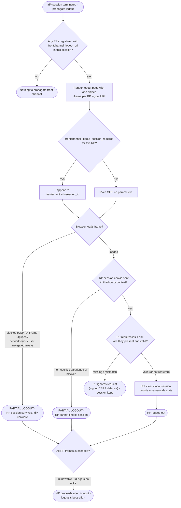

# Front-Channel Logout — Decision Flowchart

Decision logic from the IdP emitting iframes through each RP's handling of the
logout URI request, with explicit partial-logout terminals.

Notes

- There is deliberately no "success" edge from the IdP's perspective: the final
  terminal reflects that completeness cannot be verified over the front channel.
- Pair with [Back-Channel Logout](../back-channel-logout/README.md) when reliable
  propagation is required.

Related: [README](README.md) | [Sequence](sequence.md) | [Swimlane](swimlane.md)
