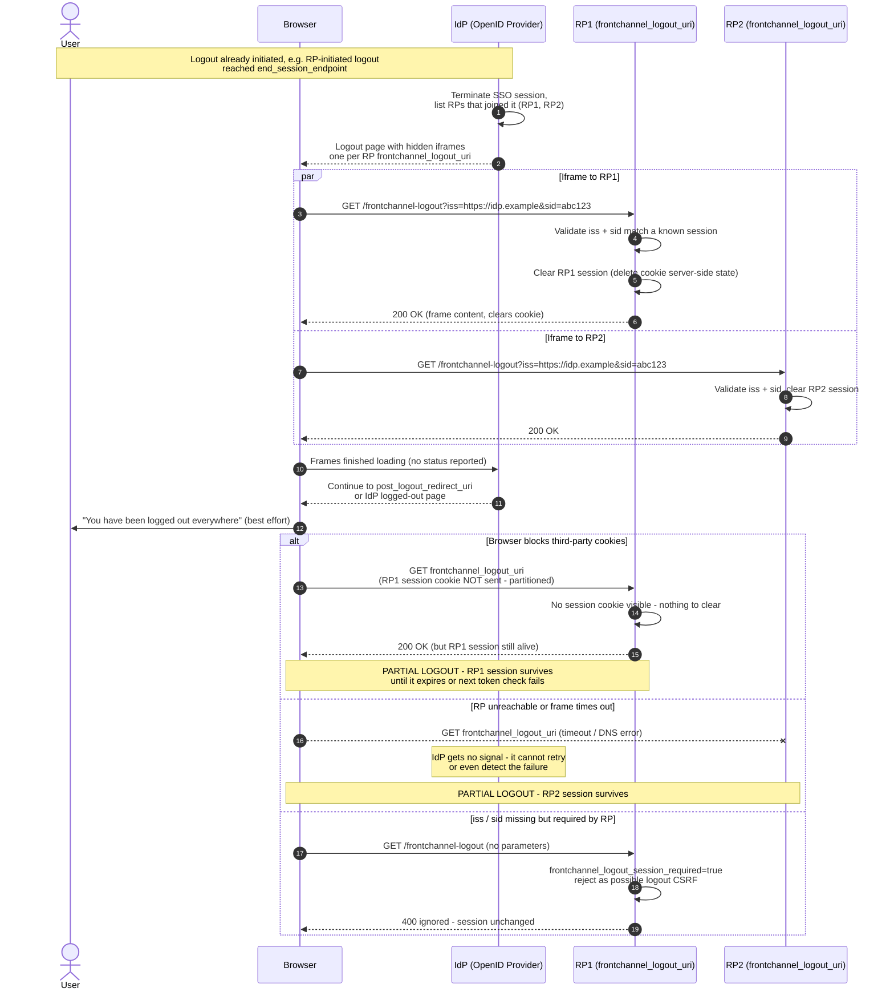

# Front-Channel Logout — Sequence Diagram

Happy path with two RPs logged out via iframes, then the partial-logout
alternates (blocked third-party cookies, unreachable RP).

Notes

- The IdP renders all frames in parallel and proceeds after a fixed timeout; there is
  no acknowledgement channel from RPs.
- `iss` and `sid` must be sent together or not at all; RPs compare `sid` to the ID
  token's `sid` claim.

Related: [README](README.md) | [Swimlane](swimlane.md) | [Flowchart](flowchart.md)
