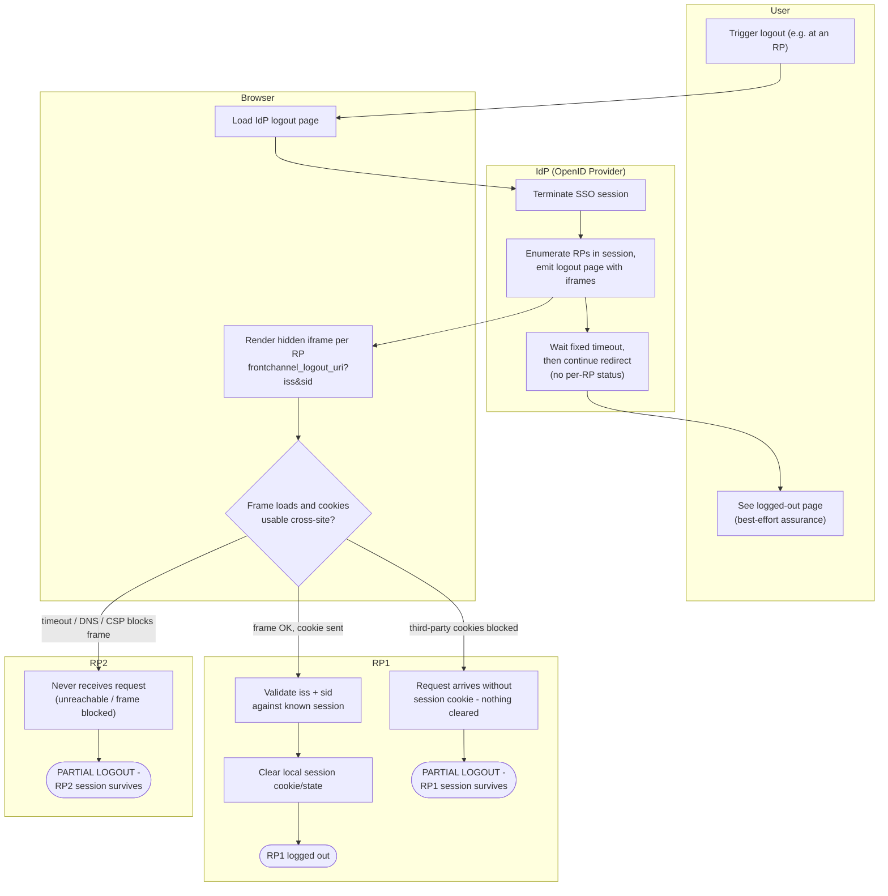

# Front-Channel Logout — Swimlane Diagram

One lane per actor. Both RP lanes receive iframe loads from the browser; the
failure exits show how each lane can silently produce a partial logout.

The IdP lane never learns which RP lanes actually cleared their sessions —
that asymmetry is the core reliability caveat of front-channel logout.

Related: [README](README.md) | [Sequence](sequence.md) | [Flowchart](flowchart.md)
