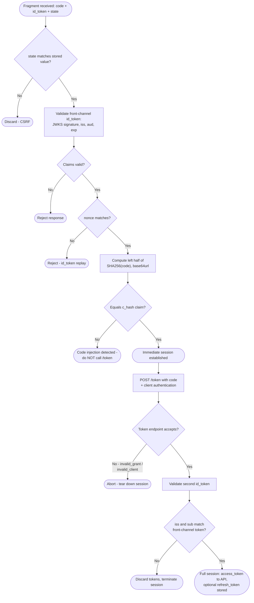

# Hybrid Flow (code id_token) — Decision Flowchart

Dual ID-token validation with c_hash as the gate before the code is redeemed.

```mermaid
flowchart TD
    S([Fragment received: code + id_token + state]) --> Q1{state matches stored value?}
    Q1 -->|No| E1([Discard - CSRF])
    Q1 -->|Yes| V1["Validate front-channel id_token:<br/>JWKS signature, iss, aud, exp"]

    V1 --> Q2{Claims valid?}
    Q2 -->|No| E2([Reject response])
    Q2 -->|Yes| Q3{nonce matches?}
    Q3 -->|No| E3([Reject - id_token replay])
    Q3 -->|Yes| H1["Compute left half of<br/>SHA256(code), base64url"]

    H1 --> Q4{Equals c_hash claim?}
    Q4 -->|No| E4(["Code injection detected -<br/>do NOT call /token"])
    Q4 -->|Yes| S1([Immediate session established])
    S1 --> T1["POST /token with code<br/>+ client authentication"]

    T1 --> Q5{Token endpoint accepts?}
    Q5 -->|"No - invalid_grant /<br/>invalid_client"| E5([Abort - tear down session])
    Q5 -->|Yes| V2["Validate second id_token"]
    V2 --> Q6{"iss and sub match<br/>front-channel token?"}
    Q6 -->|No| E6([Discard tokens, terminate session])
    Q6 -->|Yes| OK([Full session: access_token to API,<br/>optional refresh_token stored])
```
