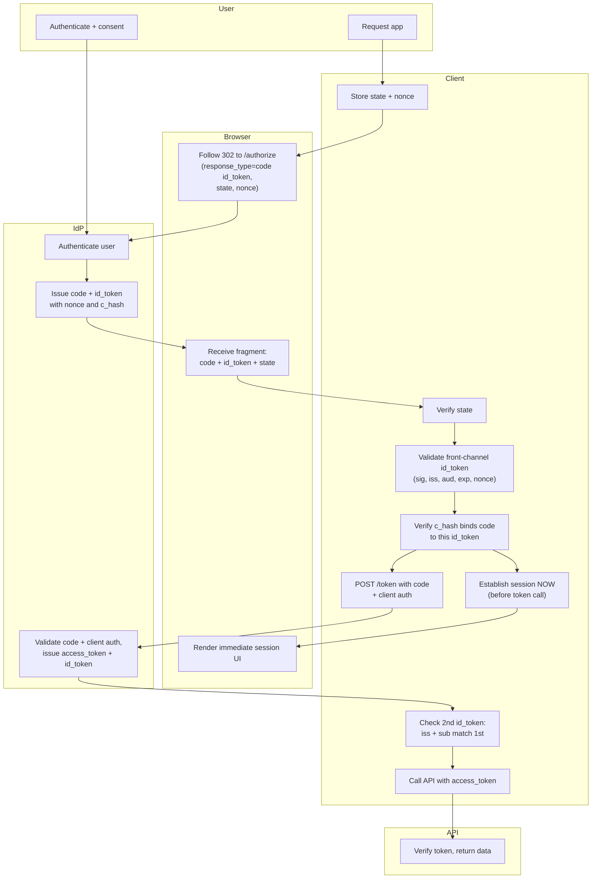

# Hybrid Flow (code id_token) — Swimlane

The Client lane splits visibly into front-channel work (immediate session from the
fragment ID token, c_hash check) and back-channel work (code redemption).

