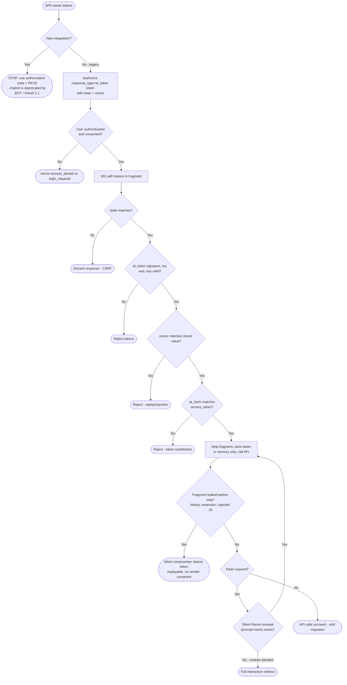

# Implicit Flow — Decision Flowchart (Deprecated)

Client-side validation branches, plus the decision every team should hit first:
whether to be using this flow at all.

```mermaid
flowchart TD
    S([SPA needs tokens]) --> Q0{New integration?}
    Q0 -->|Yes| M(["STOP: use authorization code + PKCE<br/>- implicit is deprecated by BCP / OAuth 2.1"])
    Q0 -->|No - legacy| AZ["/authorize response_type=id_token token<br/>with state + nonce"]

    AZ --> Q1{User authenticated<br/>and consented?}
    Q1 -->|No| E1([#error=access_denied or login_required])
    Q1 -->|Yes| FR["302 with tokens in fragment"]

    FR --> Q2{state matches?}
    Q2 -->|No| E2([Discard response - CSRF])
    Q2 -->|Yes| Q3{"id_token signature, iss,<br/>aud, exp valid?"}
    Q3 -->|No| E3([Reject tokens])
    Q3 -->|Yes| Q4{nonce matches stored value?}
    Q4 -->|No| E4([Reject - replay/injection])
    Q4 -->|Yes| Q5{"at_hash matches<br/>access_token?"}
    Q5 -->|No| E5([Reject - token substitution])
    Q5 -->|Yes| U1["Strip fragment, store token<br/>in memory only, call API"]

    U1 --> Q6{Fragment leaked before strip?<br/>history, extension, injected JS}
    Q6 -->|Yes| E6(["Silent compromise: bearer token<br/>replayable, no sender constraint"])
    Q6 -->|No| Q7{Token expired?}
    Q7 -->|Yes| Q8{"Silent iframe renewal<br/>(prompt=none) works?"}
    Q8 -->|No - cookies blocked| E7([Full interactive redirect])
    Q8 -->|Yes| U1
    Q7 -->|No| OK([API calls succeed - until migration])
```
