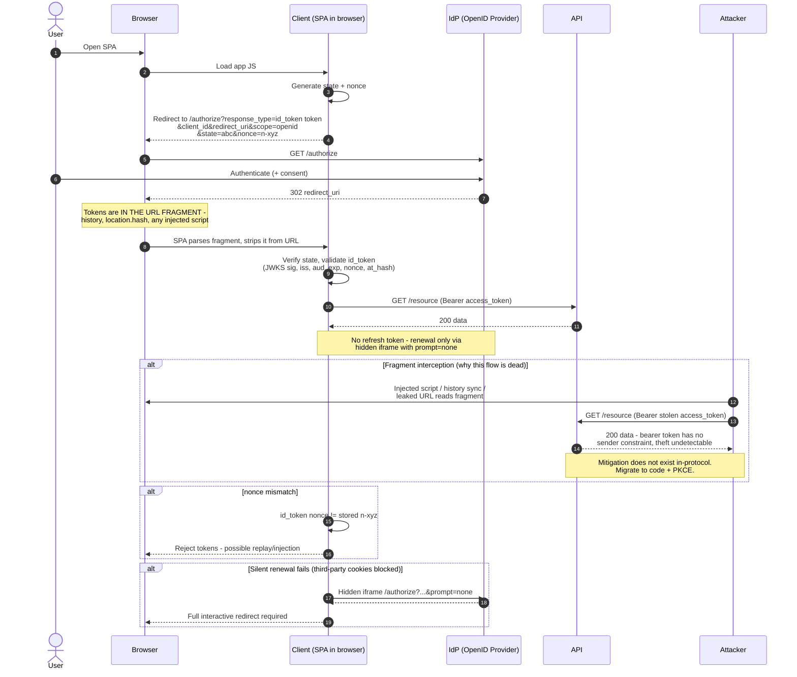

# Implicit Flow — Sequence Diagram (Deprecated)

Happy path first, then the fragment-interception alternate showing why the flow is
deprecated, plus nonce-mismatch and silent-renewal failures.

```mermaid
sequenceDiagram
    autonumber
    actor User
    participant Browser
    participant Client as Client (SPA in browser)
    participant IdP as IdP (OpenID Provider)
    participant API
    participant Atk as Attacker

    User->>Browser: Open SPA
    Browser->>Client: Load app JS
    Client->>Client: Generate state + nonce
    Client-->>Browser: Redirect to /authorize?response_type=id_token token<br/>&client_id&redirect_uri&scope=openid<br/>&state=abc&nonce=n-xyz
    Browser->>IdP: GET /authorize
    User->>IdP: Authenticate (+ consent)
    IdP-->>Browser: 302 redirect_uri#id_token=eyJ...&access_token=SlAV32hkKG<br/>&token_type=Bearer&expires_in=3600&state=abc
    Note over Browser: Tokens are IN THE URL FRAGMENT -<br/>history, location.hash, any injected script
    Browser->>Client: SPA parses fragment, strips it from URL
    Client->>Client: Verify state, validate id_token<br/>(JWKS sig, iss, aud, exp, nonce, at_hash)
    Client->>API: GET /resource (Bearer access_token)
    API-->>Client: 200 data
    Note over Client,IdP: No refresh token - renewal only via<br/>hidden iframe with prompt=none

    alt Fragment interception (why this flow is dead)
        Atk->>Browser: Injected script / history sync /<br/>leaked URL reads fragment
        Atk->>API: GET /resource (Bearer stolen access_token)
        API-->>Atk: 200 data - bearer token has no<br/>sender constraint, theft undetectable
        Note over Atk,API: Mitigation does not exist in-protocol.<br/>Migrate to code + PKCE.
    end

    alt nonce mismatch
        Client->>Client: id_token nonce != stored n-xyz
        Client-->>Browser: Reject tokens - possible replay/injection
    end

    alt Silent renewal fails (third-party cookies blocked)
        Client->>IdP: Hidden iframe /authorize?...&prompt=none
        IdP-->>Client: #error=login_required
        Client-->>Browser: Full interactive redirect required
    end
```
