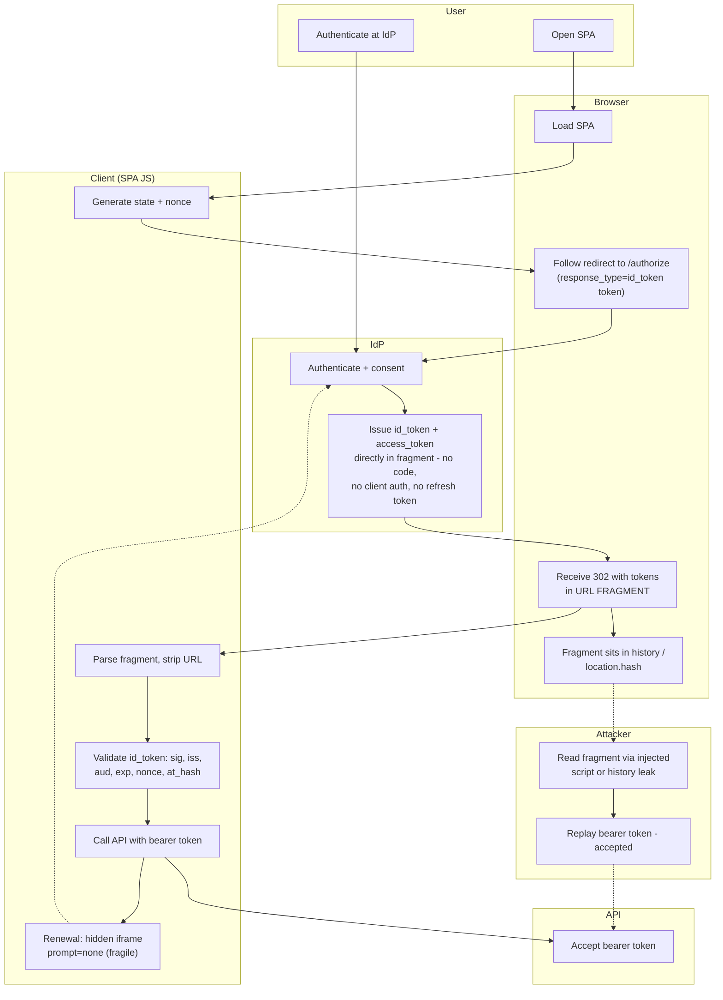

# Implicit Flow — Swimlane (Deprecated)

Note that tokens cross the Browser lane in the URL itself — the structural flaw that
code + PKCE removes by moving token delivery to a back channel.

```mermaid
flowchart TD
    subgraph User
        U1[Open SPA]
        U2[Authenticate at IdP]
    end

    subgraph Browser
        B1[Load SPA]
        B2["Follow redirect to /authorize<br/>(response_type=id_token token)"]
        B3["Receive 302 with tokens<br/>in URL FRAGMENT"]
        B4["Fragment sits in history /<br/>location.hash"]
    end

    subgraph Client["Client (SPA JS)"]
        C1[Generate state + nonce]
        C2["Parse fragment, strip URL"]
        C3["Validate id_token: sig, iss,<br/>aud, exp, nonce, at_hash"]
        C4["Call API with bearer token"]
        C5["Renewal: hidden iframe<br/>prompt=none (fragile)"]
    end

    subgraph IdP
        I1[Authenticate + consent]
        I2["Issue id_token + access_token<br/>directly in fragment - no code,<br/>no client auth, no refresh token"]
    end

    subgraph API
        P1[Accept bearer token]
    end

    subgraph Attacker
        X1["Read fragment via injected<br/>script or history leak"]
        X2["Replay bearer token - accepted"]
    end

    U1 --> B1 --> C1 --> B2 --> I1
    U2 --> I1 --> I2 --> B3 --> C2 --> C3 --> C4 --> P1
    C4 --> C5 -.-> I1
    B3 --> B4 -.-> X1 --> X2 -.-> P1
```
