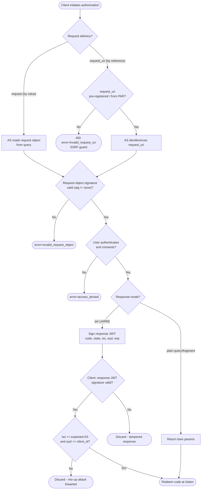

# JAR / JARM — Decision Flowchart

Request-object delivery and verification, then JARM response verification, with
explicit error terminals.

```mermaid
flowchart TD
    S(["Client initiates authorization"]) --> Q1{Request delivery?}
    Q1 -->|"request (by value)"| R1["AS reads request object<br/>from query"]
    Q1 -->|"request_uri (by reference)"| R2{request_uri<br/>pre-registered / from PAR?}
    R2 -->|No| E1(["400 error=invalid_request_uri<br/>SSRF guard"])
    R2 -->|Yes| R3["AS dereferences request_uri"]

    R1 --> Q2{"Request-object signature<br/>valid (alg != none)?"}
    R3 --> Q2
    Q2 -->|No| E2(["error=invalid_request_object"])
    Q2 -->|Yes| Q3{User authenticates<br/>and consents?}
    Q3 -->|No| E3([error=access_denied])
    Q3 -->|Yes| Q4{Response mode?}

    Q4 -->|"jwt (JARM)"| J1["Sign response JWT:<br/>code, state, iss, aud, exp"]
    Q4 -->|"plain query/fragment"| J2["Return bare params"]

    J1 --> V1{"Client: response JWT<br/>signature valid?"}
    V1 -->|No| E4(["Discard - tampered response"])
    V1 -->|Yes| V2{"iss == expected AS<br/>and aud == client_id?"}
    V2 -->|No| E5(["Discard - mix-up attack thwarted"])
    V2 -->|Yes| OK(["Redeem code at /token"])
    J2 --> OK
```
