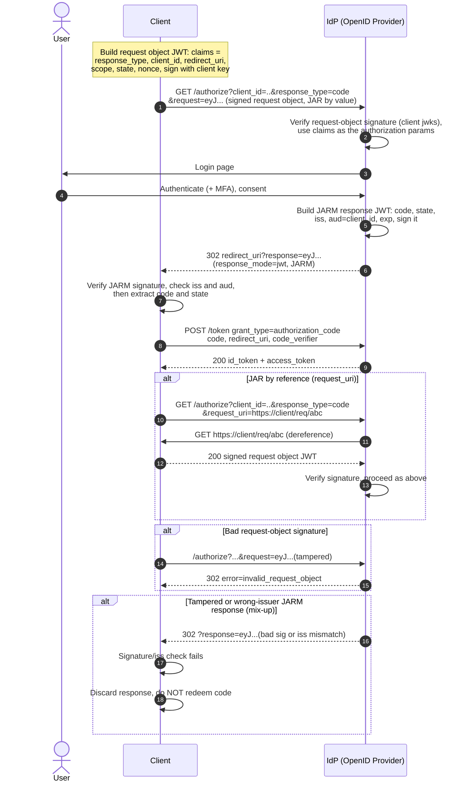

# JAR / JARM — Sequence Diagram

Happy path (signed request object by value, JARM signed response) first, then JAR by
reference, and the signature-failure / mix-up alternates.

```mermaid
sequenceDiagram
    autonumber
    actor User
    participant Client
    participant IdP as IdP (OpenID Provider)

    Note over Client: Build request object JWT: claims =<br/>response_type, client_id, redirect_uri,<br/>scope, state, nonce, sign with client key
    Client->>IdP: GET /authorize?client_id=..&response_type=code<br/>&request=eyJ... (signed request object, JAR by value)
    IdP->>IdP: Verify request-object signature (client jwks),<br/>use claims as the authorization params
    IdP->>User: Login page
    User->>IdP: Authenticate (+ MFA), consent
    IdP->>IdP: Build JARM response JWT: code, state,<br/>iss, aud=client_id, exp, sign it
    IdP-->>Client: 302 redirect_uri?response=eyJ...<br/>(response_mode=jwt, JARM)
    Client->>Client: Verify JARM signature, check iss and aud,<br/>then extract code and state
    Client->>IdP: POST /token grant_type=authorization_code<br/>code, redirect_uri, code_verifier
    IdP-->>Client: 200 id_token + access_token

    alt JAR by reference (request_uri)
        Client->>IdP: GET /authorize?client_id=..&response_type=code<br/>&request_uri=https://client/req/abc
        IdP->>Client: GET https://client/req/abc (dereference)
        Client-->>IdP: 200 signed request object JWT
        IdP->>IdP: Verify signature, proceed as above
    end

    alt Bad request-object signature
        Client->>IdP: /authorize?...&request=eyJ...(tampered)
        IdP-->>Client: 302 error=invalid_request_object
    end

    alt Tampered or wrong-issuer JARM response (mix-up)
        IdP-->>Client: 302 ?response=eyJ...(bad sig or iss mismatch)
        Client->>Client: Signature/iss check fails
        Client->>Client: Discard response, do NOT redeem code
    end
```
