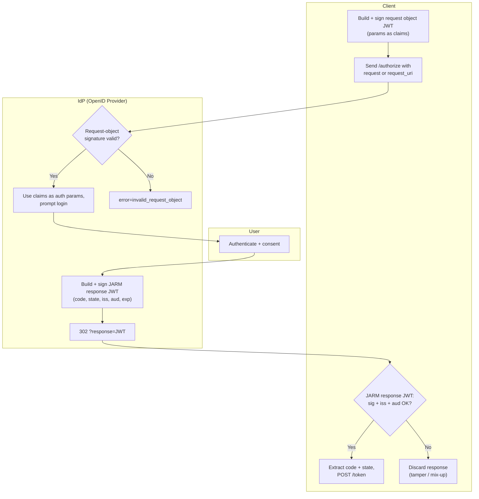

# JAR / JARM — Swimlane

The Client signs the request object and verifies the response JWT; the IdP verifies
the request object and signs the JARM response.

```mermaid
flowchart TD
    subgraph User
        U1["Authenticate + consent"]
    end

    subgraph Client
        C1["Build + sign request object JWT<br/>(params as claims)"]
        C2["Send /authorize with<br/>request or request_uri"]
        C3{"JARM response JWT:<br/>sig + iss + aud OK?"}
        C4["Extract code + state,<br/>POST /token"]
        C5["Discard response<br/>(tamper / mix-up)"]
    end

    subgraph IdP["IdP (OpenID Provider)"]
        I1{"Request-object<br/>signature valid?"}
        I2["Use claims as auth params,<br/>prompt login"]
        I3["Build + sign JARM response JWT<br/>(code, state, iss, aud, exp)"]
        I4["302 ?response=JWT"]
        I5["error=invalid_request_object"]
    end

    C1 --> C2 --> I1
    I1 -->|No| I5
    I1 -->|Yes| I2 --> U1 --> I3 --> I4 --> C3
    C3 -->|Yes| C4
    C3 -->|No| C5
```
