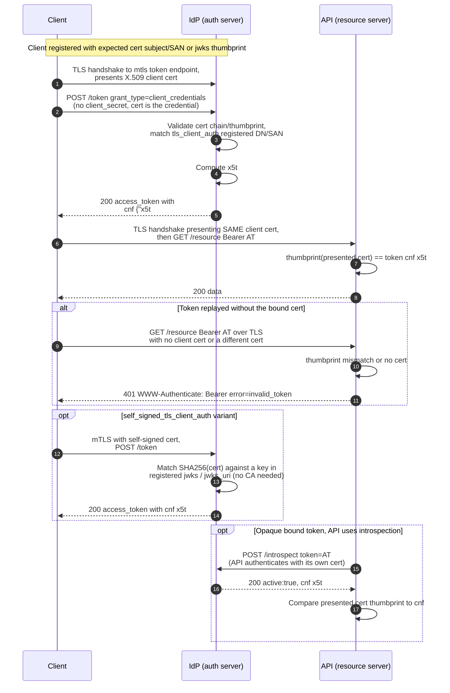

# mTLS Client Auth and Certificate-Bound Tokens — Sequence Diagram

Happy path (mTLS auth then bound-token use) first, then a replay on an unbound
connection, the self-signed variant, and introspection of a bound token.

