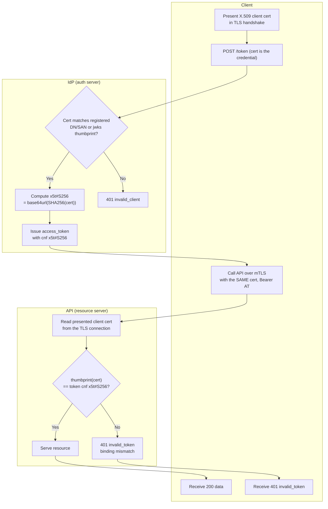

# mTLS Client Auth and Certificate-Bound Tokens — Swimlane

The Client presents the same certificate at the token endpoint and the API; the API
lane does the thumbprint bind-check.

```mermaid
flowchart TD
    subgraph Client
        C1["Present X.509 client cert<br/>in TLS handshake"]
        C2["POST /token (cert is the credential)"]
        C3["Call API over mTLS<br/>with the SAME cert, Bearer AT"]
        C4["Receive 200 data"]
        C5["Receive 401 invalid_token"]
    end

    subgraph IdP["IdP (auth server)"]
        I1{"Cert matches registered<br/>DN/SAN or jwks thumbprint?"}
        I2["Compute x5t#S256<br/>= base64url(SHA256(cert))"]
        I3["Issue access_token<br/>with cnf x5t#S256"]
        I4["401 invalid_client"]
    end

    subgraph API["API (resource server)"]
        A1["Read presented client cert<br/>from the TLS connection"]
        A2{"thumbprint(cert)<br/>== token cnf x5t#S256?"}
        A3["Serve resource"]
        A4["401 invalid_token<br/>binding mismatch"]
    end

    C1 --> C2 --> I1
    I1 -->|No| I4
    I1 -->|Yes| I2 --> I3 --> C3
    C3 --> A1 --> A2
    A2 -->|Yes| A3 --> C4
    A2 -->|No| A4 --> C5
```
