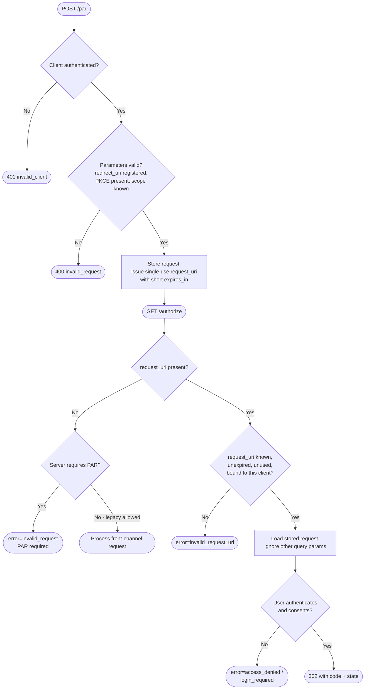

# Pushed Authorization Requests — Decision Flowchart

The two AS decision points: validating the push at `/par`, and resolving the
`request_uri` (or enforcing require-PAR) at `/authorize`.

```mermaid
flowchart TD
    S(["POST /par"]) --> Q1{Client authenticated?}
    Q1 -->|No| E1(["401 invalid_client"])
    Q1 -->|Yes| Q2{Parameters valid?<br/>redirect_uri registered,<br/>PKCE present, scope known}
    Q2 -->|No| E2(["400 invalid_request"])
    Q2 -->|Yes| P1["Store request,<br/>issue single-use request_uri<br/>with short expires_in"]
    P1 --> AZ

    AZ(["GET /authorize"]) --> Q3{request_uri present?}
    Q3 -->|No| Q4{Server requires PAR?}
    Q4 -->|Yes| E3(["error=invalid_request<br/>PAR required"])
    Q4 -->|"No - legacy allowed"| LEGACY([Process front-channel request])
    Q3 -->|Yes| Q5{request_uri known,<br/>unexpired, unused,<br/>bound to this client?}
    Q5 -->|No| E4(["error=invalid_request_uri"])
    Q5 -->|Yes| RES["Load stored request,<br/>ignore other query params"]
    RES --> Q6{User authenticates<br/>and consents?}
    Q6 -->|No| E5([error=access_denied /<br/>login_required])
    Q6 -->|Yes| OK([302 with code + state])
```
