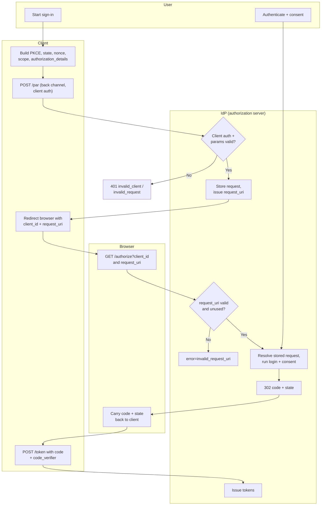

# Pushed Authorization Requests — Swimlane

The Client pushes on the back channel; the Browser only ever carries the short
`request_uri`; the IdP resolves it and ignores stray query parameters.

```mermaid
flowchart TD
    subgraph User
        U1["Start sign-in"]
        U2["Authenticate + consent"]
    end

    subgraph Client
        C1["Build PKCE, state, nonce,<br/>scope, authorization_details"]
        C2["POST /par (back channel,<br/>client auth)"]
        C3["Redirect browser with<br/>client_id + request_uri"]
        C4["POST /token with code<br/>+ code_verifier"]
    end

    subgraph Browser
        B1["GET /authorize?client_id<br/>and request_uri"]
        B2["Carry code + state<br/>back to client"]
    end

    subgraph IdP["IdP (authorization server)"]
        I1{"Client auth +<br/>params valid?"}
        I2["Store request,<br/>issue request_uri"]
        I3{"request_uri valid<br/>and unused?"}
        I4["Resolve stored request,<br/>run login + consent"]
        I5["302 code + state"]
        I6["Issue tokens"]
        I7["error=invalid_request_uri"]
    end

    U1 --> C1 --> C2 --> I1
    I1 -->|No| E1["401 invalid_client /<br/>invalid_request"]
    I1 -->|Yes| I2 --> C3 --> B1 --> I3
    I3 -->|No| I7
    I3 -->|Yes| I4
    U2 --> I4 --> I5 --> B2 --> C4 --> I6
```
