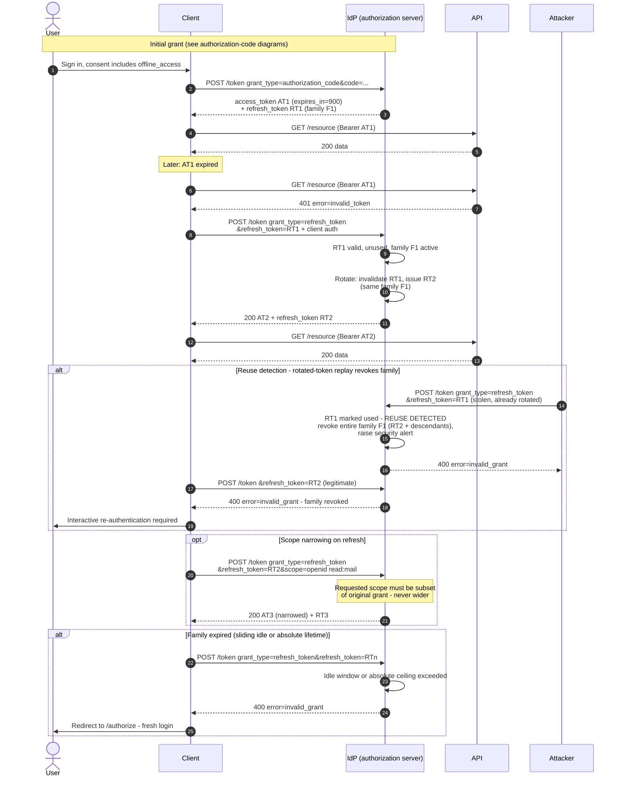

# Refresh Token Grant — Sequence Diagram

Initial issuance with `offline_access`, rotation on refresh, then reuse detection
revoking the token family, plus scope narrowing and expiry alternates.

```mermaid
sequenceDiagram
    autonumber
    actor User
    participant Client
    participant IdP as IdP (authorization server)
    participant API
    participant Atk as Attacker

    Note over User,IdP: Initial grant (see authorization-code diagrams)
    User->>Client: Sign in, consent includes offline_access
    Client->>IdP: POST /token grant_type=authorization_code&code=...
    IdP-->>Client: access_token AT1 (expires_in=900)<br/>+ refresh_token RT1 (family F1)

    Client->>API: GET /resource (Bearer AT1)
    API-->>Client: 200 data
    Note over Client: Later: AT1 expired
    Client->>API: GET /resource (Bearer AT1)
    API-->>Client: 401 error=invalid_token

    Client->>IdP: POST /token grant_type=refresh_token<br/>&refresh_token=RT1 + client auth
    IdP->>IdP: RT1 valid, unused, family F1 active
    IdP->>IdP: Rotate: invalidate RT1, issue RT2<br/>(same family F1)
    IdP-->>Client: 200 AT2 + refresh_token RT2
    Client->>API: GET /resource (Bearer AT2)
    API-->>Client: 200 data

    alt Reuse detection - rotated-token replay revokes family
        Atk->>IdP: POST /token grant_type=refresh_token<br/>&refresh_token=RT1 (stolen, already rotated)
        IdP->>IdP: RT1 marked used - REUSE DETECTED<br/>revoke entire family F1 (RT2 + descendants),<br/>raise security alert
        IdP-->>Atk: 400 error=invalid_grant
        Client->>IdP: POST /token &refresh_token=RT2 (legitimate)
        IdP-->>Client: 400 error=invalid_grant - family revoked
        Client->>User: Interactive re-authentication required
    end

    opt Scope narrowing on refresh
        Client->>IdP: POST /token grant_type=refresh_token<br/>&refresh_token=RT2&scope=openid read:mail
        Note over IdP: Requested scope must be subset<br/>of original grant - never wider
        IdP-->>Client: 200 AT3 (narrowed) + RT3
    end

    alt Family expired (sliding idle or absolute lifetime)
        Client->>IdP: POST /token grant_type=refresh_token&refresh_token=RTn
        IdP->>IdP: Idle window or absolute ceiling exceeded
        IdP-->>Client: 400 error=invalid_grant
        Client->>User: Redirect to /authorize - fresh login
    end
```
